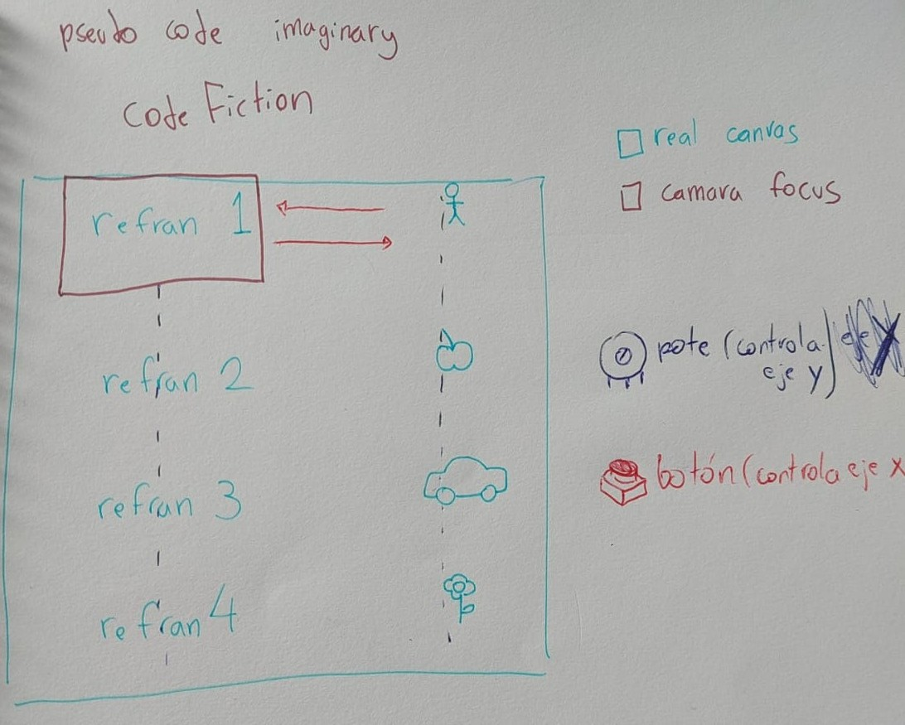
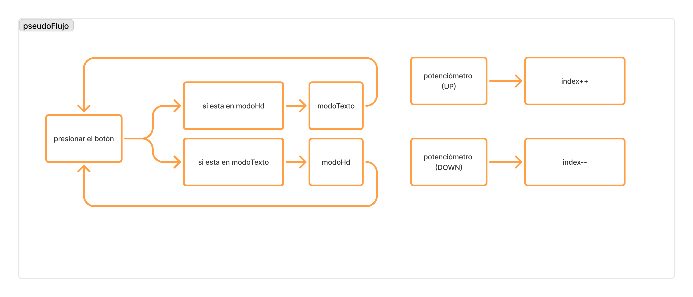

# poemSampler

## Acerca del proyecto

- Grupo: 01
- Nombre de grupo: maincraf
- Integrantes:
  - Camila Delgado
  - Braulio Figueroa
  - Santiago Gaete
  - Camila Parada

## Presentación textual

* BORRAR AL ÚLTIMO LA INDICACIÓN * Plantea aquí el problema de diseño que abordaste. Menciona el texto de referencia.

poemSampler comienza como una interfaz que permite funsionar estractos de distintos poemas, para crear tus propios "remixes". Debido a limitaciones técnicas, el proyecto fue iterando a medida que avanzábamos en el código:

- Versión 1: poema scrollea automáticamente. Algunas palabras se ven destacadas. Al escribir una de esas palabras, aprece una imagen en un segunda pantalla.

- Versión 2: el scroll se controla con el potenciómetro. Al presionar un botón, en una segunda pantalla se ve una imagen asociada al refrán.

- Versión 3: con el potenciómetro controlas el scroll de los refranes. Al presionarl botón, aparece una imagen respecto al refrán y el texto se va. Al usar el potenciómetro, vuelve a verse el texto y la imagen desaparece. La imagenes son combinables entre sí.

- Versión 4: el potenciómetro permite scrollear entre los elementos de la lista. Con el botón vas turnando entre la lista de texto(void modoTexto()) y la lista de imagenes (void modoHd).

El usuario puede navegar entre los refranes usando el potenciómetro, ya sea de manera textual, o de manera visual. Para ir cambiando entre ambas maneras, se usa el botón.

## Inputs y outputs

* BORRAR AL ÚLTIMO LA INDICACIÓN * ¿Cuál es la interacción? ¿Qué ofrece la máquina de vuelta?

## Bocetos de planificación

* BORRAR AL ÚLTIMO LA INDICACIÓN * Fotografías y dibujos de maquetas y pruebas


 



## Etapas del código

Segmenta las secciones de tu código y explícalas

- variables extraídas de la librería
```cpp
#include <Adafruit_GFX.h>
#include <Adafruit_SSD1306.h>
#include <Wire.h>
#define screenW 128
#define screenH 64
#define oledReset -1
#define screenAdress 0x3C
Adafruit_SSD1306 display(screenW, screenH, &Wire, oledReset);
```

- variables específicas del código
```cpp
//variable que lleva la cuenta de cuántas veces se ha presionado el botón
int botonComputo = 0;
//pin del botón
int botonPin = 2;
//pin del potenciómtro
int potePin = A0;
```

- listado de refranes

```cpp
char* refranes[] = { "perro ke ladra no muerde",
                     "se le escapan lo' enanito' del bosqe",
                     "kear como xaleca 'e mono",
                     "pasar gato x liebre",
                     "cria cuervo' y te sacaran lo' ojo'"};
```
- bitmaps: contenido internoborrado para hacer este documento más legibble

```cpp
const unsigned char bitmapPerro[] PROGMEM = {
};
const unsigned char bitmapEnano[] PROGMEM = {
};
const unsigned char bitmapMono[] PROGMEM = {
};
const unsigned char bitmapGato[] PROGMEM = {
};
const unsigned char bitmapCuervo[] PROGMEM = {
};
```
- listado de bitmaps
```cpp
const int bitmapArrayLength = 5;
const unsigned char* bitmapArray[5] = {
  bitmapPerro, bitmapEnano, bitmapMono, bitmapGato, bitmapCuervo
};
```
- setup 

```cpp
void setup() {
  //<https://docs-arduino-cc.translate.goog/language-reference/en/functions/communication/serial/begin/>
  Serial.begin(9600);
  //extraído de la librería de adafruit. En caso de que falle la conexión, imprime un mensaje.
  if (!display.begin(SSD1306_SWITCHCAPVCC, screenAdress)) {
    Serial.println(F("SSD1306 allocation failed"));
    for (;;)
      ;
  }
  // configurar el pin para recibir datos.
  pinMode(botonPin, INPUT_PULLUP);

  //setear el display
  display.clearDisplay();
  display.setTextSize(1);
  display.setTextColor(SSD1306_WHITE);
  display.display();
}
```
- loop: la variable votoComputo lleva la cuenta de cuántas veces fue presionado el botón. En los números pares está en modoPoeta(), en los números impares en modoHd().

```cpp
void loop() {
  //contar las veces que se ha presionado el botón <https://forum.arduino.cc/t/counting-button-presses/119881/4>
  if (digitalRead(botonPin) == LOW) {
    botonComputo++;
    delay(200);
  }
  //<https://docs.arduino.cc/language-reference/en/structure/arithmetic-operators/remainder>
  //<https://github.com/clifford1one/voluntadGuiada/blob/main/code/interact.js>
  if (botonComputo % 2 == 0) {
    //números pares
    modoPoeta();
  } else {
    //números impares
    modoHd();
  }
}
```
- void modoPoeta: creé esta función, que contiene los refranes textuales. 
```cpp
//el modo donde se leen los refranes
void modoPoeta() {
  display.stopscroll();
  display.clearDisplay();
  int poteValue = analogRead(potePin);
  //<https://www.w3schools.com/cpp/cpp_arrays_loop.asp>
  //<https://www.youtube.com/watch?v=RXWO3mFuW-I&t=303s>
  //poteValue lo divido en 205, porque quiero que el pote se deivida en 5 "secciones".
  //1023/5 = 204,6
  int fraccionPote = poteValue / 205;
  //<https://docs.arduino.cc/language-reference/en/functions/math/constrain>
  fraccionPote = constrain(fraccionPote, 0, 4);
  display.setCursor(0, 20);
  display.println(refranes[fraccionPote]);
  display.display();
}
```
- void modoHd(): creé este void que contiene las imágenes basadas en los refranes.
```cpp

void modoHd() {
  display.stopscroll();
  display.clearDisplay();
  int poteValue = analogRead(potePin);
  int fraccionPote = poteValue / 205;
  fraccionPote = constrain(fraccionPote, 0, 4);
  display.drawBitmap(0, 0, bitmapArray[fraccionPote], screenW, screenH, SSD1306_WHITE);
  display.display();
}
```

## Roles del equipo

Menciona y desarrolla los roles que ejerció cada integrante

## Fotografías y videos del proyecto funcionado

Subir fotos y videos

El video debe estar subido a youtube y mencionado en un enlace para ahorrar espacio en el repositorio

## Bibliografía

Citas en APA de repositorios y enlaces de los cuales se inspiraron. Bibliotecas, tutoriales, etc.
