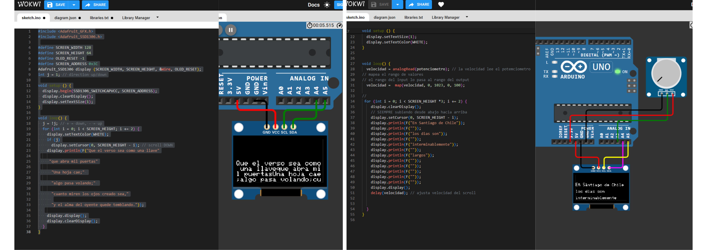
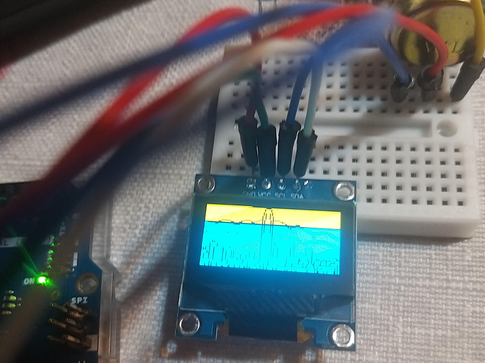

# Proyecto-01

## Acerca del proyecto

- Grupo: 05 / ARRAY
- Integrantes:
  - [Aileen D'Espesailles](https://github.com/Bernardita-lobo/dis8645-2025-02-procesos/tree/main/08-aileendespessailles-design)
  - [Bernardita Lobo](https://github.com/Bernardita-lobo/dis8645-2025-02-procesos)
  - [Carla Pino](https://github.com/Bernardita-lobo/dis8645-2025-02-procesos/tree/main/23-Coff4)
  - [Félix Rodríguez](https://github.com/Bernardita-lobo/dis8645-2025-02-procesos/tree/main/25-felix-rg416)

## Presentación textual

> Plantea aquí el problema de diseño que abordaste. Menciona el texto de referencia.

El problema de diseño que abordamos fue cómo mostrar un poema de manera dinámica en una pantalla OLED, controlando su velocidad de desplazamiento vertical con una interfaz física simple e intuitiva: un potenciómetro.

El objetivo es generar una experiencia poética interactiva, donde el espectador pueda decidir el ritmo de la lectura.

### Poema Cronos

Texto de referencia: Poema “Cronos” de Nicanor Parra, extraído de: <https://www.poemas-del-alma.com/nicanor-parra-cronos.htm>

*"En Santiago de Chile*

*Los*

*días*

*son*

*interminablemente*

*largos:*

*Varias eternidades en un día.*

*Nos desplazamos a lomo de luma*

*Como los vendedores de cochayuyo:*

*Se bosteza. Se vuelve a bostezar.*

*Sin embargo las semanas son cortas*

*Los meses pasan a toda carrera*

*Ylosañosparecequevolaran."*

## Inputs y outputs

¿Cuál es la interacción? ¿Qué ofrece la máquina de vuelta?

Se interactúa al mover la perilla del potenciómetro, la cual regula la velocidad a la que se muestra el poema y la imagen en la pantalla. Esto nos ofrece una exhibición de un poema que se desplaza a lo largo de la pantalla de manera automática. 

### Interacción (input):

El usuario mueve la perilla del potenciómetro.

### Salida de la máquina (output):

- El texto del poema se desplaza en la pantalla OLED desde abajo hacia arriba.
- La velocidad del desplazamiento depende de la posición del potenciómetro.

De este modo, se ofrece una exhibición del poema que responde en tiempo real a la acción del usuario.

### Diagrama de flujo


### Pixel art

Para nuestro proyecto decidimos agregar una imagen que se reproduzca en la pantalla. Optamos por crear un pixel art y, para que tenga más relación con el poema, decidimos hacer una pequeña representación de Santiago.

Bernardita estuvo investigando algunas herramientas gratuitas para hacer pixel art, ya que nunca había hecho un dibujo de este estilo y no tenía mucha experiencia en lo gráfico. Realizó el dibujo finalmente en Paint, ya que con las herramientas que tenía era suficiente.

Video de referencia introductoria al pixel art. [CÓMO HACER PIXEL ART: Guía completa para principiantes ||Conceptos básicos, trucos y consejos.](https://youtu.be/YyC2i91EwNw?si=XXv2mYEYJoBRogo8)

Video de referencia sobre el trazado en el pixel art. [CÓMO HACER PIXEL ART: Uso de Líneas y errores comunes (Doubles y Jaggies)](https://youtu.be/sGLBMKD7eDc?si=nGjneOnJ1f0_kIvZ)

Utilizamos una página web que convierte dibujos en código, transformándolos en ceros y unos. Esta herramienta nos permitió llevar el pixel art a la pantalla de manera más sencilla. <https://javl.github.io/image2cpp/>


## Etapas del código y errores

### Poema

En la primera parte del código probamos cómo poner una parte del poema para que aparezca en la pantalla. Intentamos varias formas para ver cómo quedaría mejor:
- `display.println(F("En Santiago de Chile\los dias son\interminablemente\largos"));` esta forma no sirve para que los versos en líneas separadas
- `display.println(F("En Santiago de Chile" "los dias son" "interminablemente" "largos"));` de esta manera, al igual que la anterior, los versos no aparecen en líneas separadas.
- `display.println(F("En Santiago de Chile"));` para escribir el verso y `display.println(F(""));` para separar el verso del siguiente



Luego, probamos cómo poner la imagen en la pantalla, vimos que aparecía sobre el texto. Vimos que se debía cambiar las coordenadas desde donde inicia la imagen: `display.drawBitmap(0, SCREEN_HEIGHT - i + SCREEN_HEIGHT ... );`


Luego de modificar también el tamaño de la imagen en `display.drawBitmap( ... 128, 64, ...);` y ver que sí funcionaba con el perrito de @rafita.studio, pusimos nuestra imagen hecha por Bernardita.




### Codigo

#### Etapa Adafruit

```cpp
// bibliotecas que se usarán en el código
#include <Adafruit_GFX.h>
#include <Adafruit_SSD1306.h>
```

En esta sección se expresa que el código usará las bibliotecas `Adafruit_GFX.h` y `Adafruit_SSD1306.h` que deben ser instaladas previamente.

#### Etapa: #define, variables y constantes

Esta etapa es la que define las partes más impotantes del código. Les pone nombre y define las variables y constantes.

```cpp
// se define el tamaño de la pantalla
#define SCREEN_WIDTH 128
#define SCREEN_HEIGHT 64
// se define el pin de RESET de la pantalla
// en este caso el -1 significa que no hay botón RESET
#define OLED_RESET -1
// se define que 0x3C es la dirección de la pantalla
#define SCREEN_ADDRESS 0x3C
// se define que A3 es el potenciometro
#define potenciometro A3
// se crea y se inicia la pantalla OLED
Adafruit_SSD1306 display (SCREEN_WIDTH, SCREEN_HEIGHT, &Wire, OLED_RESET);
// se declara la variable "velocidad" para que pueda ser usada más adelante
int velocidad; 
// se crea el array de bites que contiene la imagen
const unsigned char PROGMEM santiagoChile[] = {
// imagen en bits
0xff, 0xff, 0xff, 0xff, 0xff, 0xff ...
}
```

#### Etapa void setup

Esta parte es donde se prepara el código antes de empezar loop. Sólo se corre una vez cuando se enciende o se reinicia la placa Arduino

```cpp
void setup () {
  // inicia la pantalla OLED
  display.begin(SSD1306_SWITCHCAPVCC, SCREEN_ADDRESS); 
  // limpia la pantalla antes de dibujar
  display.clearDisplay();
  // define el tamaño del texto
  display.setTextSize(1); 
  // define el color del texto
  display.setTextColor(WHITE); 
}
```

#### Etapa: void loop

Aquí se inicia lo que se hará en el loop, lo que se reproducirá una y otra vez hasta que se apague o se reinicie la placa Arduino.

```cpp
  // da comienzo al loop
void loop() {
  // se dice que la variable "velocidad" leera el "potenciometro"
  velocidad = analogRead(potenciometro);
  // se determina con map que los valores de "potenciometro" 
  // sean adaptados a la velociaad que se mueve el texto
  // el "0, 1013" definen el rango del potenciometro (input)
  // y se conviertetn a "0, 100" que será la velocidad (output) 
  velocidad = map(velocidad, 0, 1023, 0, 100);
```

##### Etapa: poema

En esta etapa se empieza a correr el poema con los valores previamente establecidos.

```cpp
  // "i = 0", se crea la variable i que empieza contando desde 0
  // "i < SCREEN_HEIGHT *5" el ciclo sigue mientras "i" sea menor a "SCREEN_HEIGHT por (*) 5"
  // " i += 2" cada vuelta "i" aumenta de 2 en 2
 for (int i = 0; i < SCREEN_HEIGHT *5; i += 2) {
  // se limpia la pantalla
   display.clearDisplay();
    // se determina que el texto vaya suiendo
    // "0" define el valor del eje X
    // "SCREEN_HEIGHT - i" define el valor del eje Y
    // que en este caso es el tamano de la pantalla
    // menos la variable "i" que va cambiando el el tiempo
    // lo cual genera que el texto inicie abajo y vaya subiendo
    display.setCursor(0, SCREEN_HEIGHT - i);
    // la pantalla imprime el primer verso del poema
    // la "F" le dice a Arduino que guarde el verso en el programa,
    // no en su memoria interna
    display.println(F("En Santiago de Chile"));
    display.println(F(""));
||||...
    // ajusta el retraso de velocidad del scroll segun fue designado en el for
    delay(velocidad);
```

##### Etapa: imagen

En esta parte se mostrará la imagen en la pantalla OLED. Se define qué imgen será, dónde aparecerá, el tamaño que tendrá y de qué color será.

```cpp
  // "0" define la posición en el eje X desde donde aparecerá
  // "SCREEN_HEIGHT - i + SCREEN_HEIGHT" define la posición en el eje Y
  // al inicio la imagen está fuera de la pantalla, mientras "i" aumenta,
  // la imagen va subiendo a la pantalla haciendo un efecto de scroll
  // "santiagoChile" llama al array de la imagen
  // "128, 64" define el ancho y el alto de la imagen
  // "WHITE" define el color de la imagen
  display.drawBitmap(0, SCREEN_HEIGHT - i + SCREEN_HEIGHT, santiagoChile, 128, 64, WHITE);
  // se llama a la pantalla para que muestre lo que se menciono
display.display();
  // establece la velocidad a la que aparecera la imagen
delay(velocidad);
```

## Actividades y roles del equipo

### Investigación sobre proyectos y código

Todos participamos en la investigación de códigos, referencias y recursos para el desarrollo del proyecto.

### Programación base / adaptación de código

Aileen adaptó el código de referencia para que el texto subiera en la pantalla.

### Integración del potenciómetro y regulación de velocidad

Aileen y Félix investigaron cómo usar el potenciómetro para controlar la velocidad y usando de base un código que servía para manejar un servomotor con un potenciómetro.

### Investigación respecto a la imagen

- Carla buscó y unió recursos sobre cómo hacer qu las imágenes aparecieran al finalizar el poema.

- Bernardita investigó sobre las imágenes y cómo integrarlas al proyecto. Además, diseñó la imagen en pixel art y organizó la redacción del proyecto en GitHub.

### Registro y proceso

- Todos tomamos fotografías y tomamos registro escrito del proceso de desarrollo del proyecto.
- Bernardita y Félix organizaron y redactaron el proyecto dentro de GitHub.

## Fotografías y videos


## Bibliografía

- Scrolling a OLED DOWN ? (2025, agosto 20). Arduino Forum. <https://forum.arduino.cc/t/scrolling-a-oled-down/1403417/8>

- <https://docs.arduino.cc/language-reference/en/functions/math/map/> // cómo usar map(). Define los valores del potenciómetro en velocidades

- <https://wokwi.com/projects/344892191015961170> ejemplo pontenciometro + servo. Sacado de <https://docs.wokwi.com/parts/wokwi-potentiometer>

- CRONOS. (s/f). Poemas-del-alma.com. Recuperado el 29 de agosto de 2025, de <https://www.poemas-del-alma.com/nicanor-parra-cronos.htm> 

- Electrónicos Por, E. M. [@ElectronicosporelMundo]. (s/f). ARDUINO - Como Mostrar el Valor del Potenciómetro en Pantalla OLED 128x64 con Arduino [[Object Object]]. Youtube. Recuperado el 29 de agosto de 2025, de <https://www.youtube.com/watch?v=l_2vnl5MOpo>

- YouTube. (s/f-b). CÓMO HACER PIXEL ART: Guía completa para principiantes ||Conceptos básicos, trucos y consejos. Youtu.Be. Recuperado el 29 de agosto de 2025, de <https://youtu.be/YyC2i91EwNw?si=ATsIx5gcO_lLDh3E>

- YouTube. (s/f). CÓMO HACER PIXEL ART: Uso de Líneas y errores comunes (Doubles y Jaggies). Youtu.Be. Recuperado el 29 de agosto de 2025, de <https://youtu.be/sGLBMKD7eDc?si=nGjneOnJ1f0_kIvZ>

- Adafruit. (s. f.). Librería SSD1306. <https://adafruit.github.io/Adafruit_SSD1306/html/>