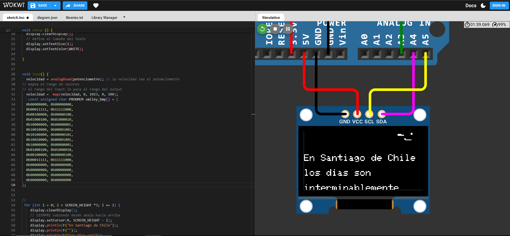
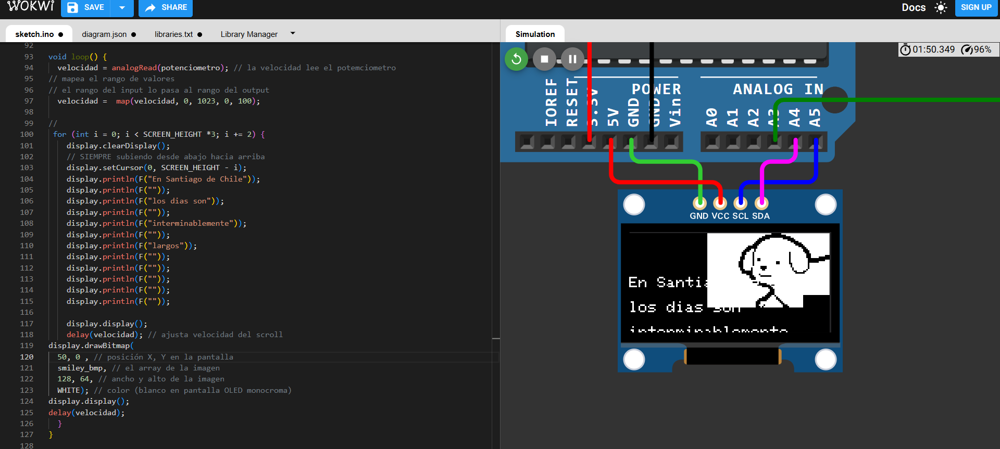
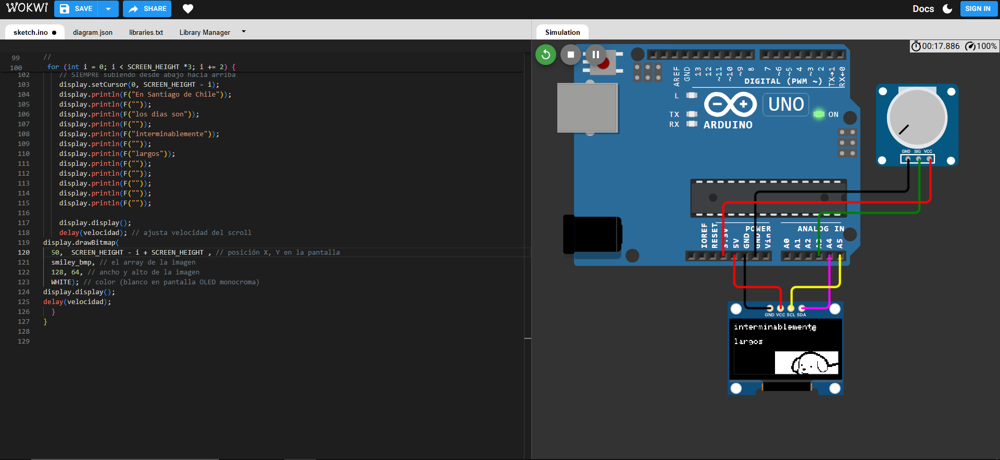
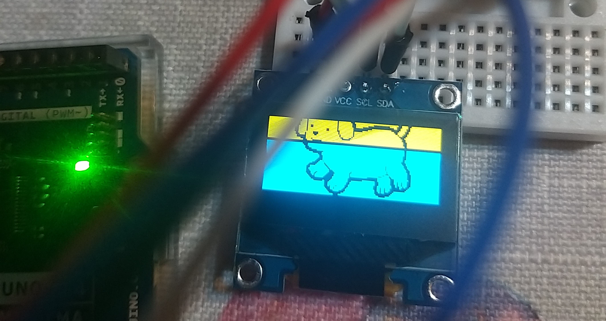
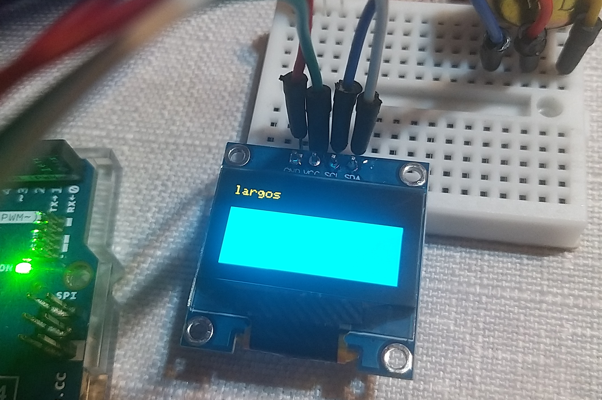
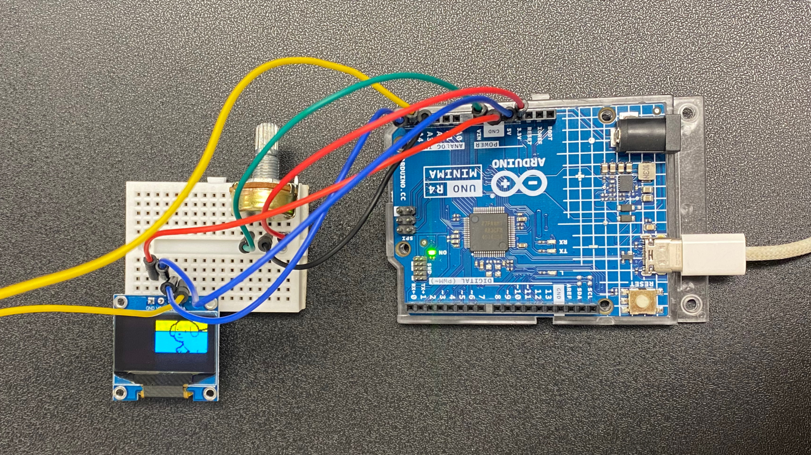
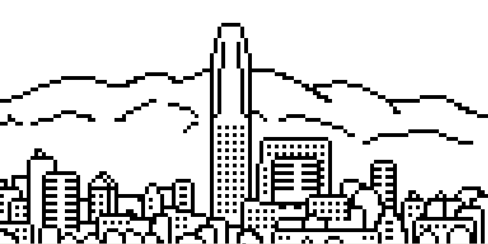
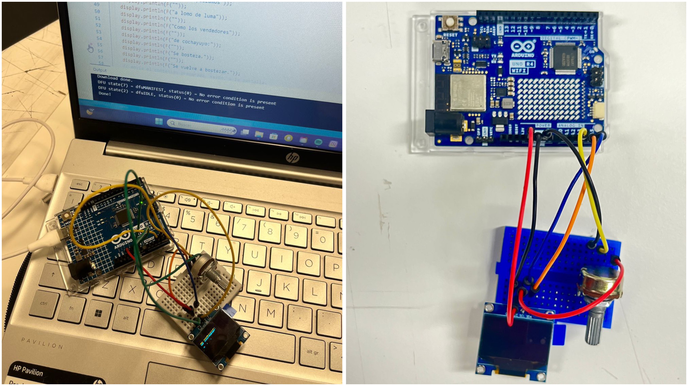

# Proyecto-01

## Acerca del proyecto

- Grupo: 05 / ARRAY
- Integrantes:
  - [Aileen D'Espesailles](https://github.com/Bernardita-lobo/dis8645-2025-02-procesos/tree/main/08-aileendespessailles-design)
  - [Bernardita Lobo](https://github.com/Bernardita-lobo/dis8645-2025-02-procesos)
  - [Carla Pino](https://github.com/Bernardita-lobo/dis8645-2025-02-procesos/tree/main/23-Coff4)
  - [Félix Rodríguez](https://github.com/Bernardita-lobo/dis8645-2025-02-procesos/tree/main/25-felix-rg416)

## Presentación textual

> Plantea aquí el problema de diseño que abordaste. Menciona el texto de referencia.

El problema de diseño que abordamos fue cómo mostrar un poema de manera dinámica en una pantalla OLED, controlando su velocidad de desplazamiento vertical con una interfaz física simple e intuitiva: un potenciómetro.

El objetivo es generar una experiencia poética interactiva, donde el espectador pueda decidir el ritmo de la lectura.

### Poema Cronos

Texto de referencia: Poema “Cronos” de Nicanor Parra, extraído de: <https://www.poemas-del-alma.com/nicanor-parra-cronos.htm>

```txt
*En Santiago de Chile*

*Los*

*días*

*son*

*interminablemente*

*largos:*

*Varias eternidades en un día.*

*Nos desplazamos a lomo de luma*

*Como los vendedores de cochayuyo:*

*Se bosteza. Se vuelve a bostezar.*

*Sin embargo las semanas son cortas*

*Los meses pasan a toda carrera*

*Ylosañosparecequevolaran.*
```

## Inputs y outputs

¿Cuál es la interacción? ¿Qué ofrece la máquina de vuelta?

Se interactúa al mover la perilla del potenciómetro, la cual regula la velocidad a la que se muestra el poema y la imagen en la pantalla. Esto nos ofrece una exhibición de un poema que se desplaza a lo largo de la pantalla de manera automática. 

### Interacción (input):

El usuario mueve la perilla del potenciómetro.

### Salida de la máquina (output):

- El texto del poema se desplaza en la pantalla OLED desde abajo hacia arriba.
- La velocidad del desplazamiento depende de la posición del potenciómetro.

De este modo, se ofrece una exhibición del poema que responde en tiempo real a la acción del usuario.

## Bocetos de planificación

>Fotografías y dibujos de maquetas y pruebas

### Diagrama de flujo


### Pixel art

Para nuestro proyecto decidimos agregar una imagen que se reproduzca en la pantalla. Optamos por crear un pixel art y, para que tenga más relación con el poema, decidimos hacer una pequeña representación de Santiago.

Bernardita estuvo investigando algunas herramientas gratuitas para hacer pixel art, ya que nunca había hecho un dibujo de este estilo y no tenía mucha experiencia en lo gráfico. Realizó el dibujo finalmente en Paint, ya que con las herramientas que tenía era suficiente.

Video de referencia introductoria al pixel art. [CÓMO HACER PIXEL ART: Guía completa para principiantes ||Conceptos básicos, trucos y consejos.](https://youtu.be/YyC2i91EwNw?si=XXv2mYEYJoBRogo8)

Video de referencia sobre el trazado en el pixel art. [CÓMO HACER PIXEL ART: Uso de Líneas y errores comunes (Doubles y Jaggies)](https://youtu.be/sGLBMKD7eDc?si=nGjneOnJ1f0_kIvZ)


## Etapas del código y errores

>Segmenta las secciones de tu código y explícalas
>
>EXPLICAR ERRORES Y COMENTARIOS













### Imagen

Esta fue una de las primeras pruebas que hicimos con una imagen. 

Se logró ver bien, aunque en este caso la imagen no se distribuía por toda la pantalla.



Utilizamos una página web que convierte dibujos en código, transformándolos en ceros y unos. Esta herramienta nos permitió llevar el pixel art a la pantalla de manera más sencilla. <https://javl.github.io/image2cpp/>



>PONER CODIGO DEL DIBUJO


## Actividades y roles del equipo

### Investigación sobre proyectos y código

- Aileen D'Espessailles, Bernardita Lobo, Carla Pino, Félix Rodríguez: Todos participaron investigando códigos, referencias y recursos para el desarrollo del proyecto.

### Programación base / adaptación de código

- Aileen D'Espessailles: Adaptó código de referencia para que el texto subiera en la pantalla.

### Integración del control del con potenciómetro y regulación de velocidad

- Aileen D'Espessailles y Félix Rodríguez: Investigaron cómo usar el potenciómetro para controlar la velocidad y lo unieron al código del servo motor.

### Investigación de aparición de imágenes tras el poema

- Carla Pino: Buscó y unió recursos para que las imágenes aparecieran al finalizar el poema.

- Bernardita Lobo: Investigó sobre las imágenes y cómo integrarlas al proyecto.

### Diseño visual

- Bernardita Lobo: Diseñó una imagen en pixel art y organizó la redacción del proyecto en GitHub.

### Registro fotográfico del proceso

- Aileen D'Espessailles, Bernardita Lobo, Carla Pino, Félix Rodríguez: Todos tomaron fotografías del proceso de desarrollo del proyecto.

## Fotografías y videos del proyecto funcionado

>Subir fotos y videos
>
>El video debe estar subido a youtube y mencionado en un enlace para ahorrar espacio en el repositorio



## Bibliografía

Citas en APA de repositorios y enlaces de los cuales se inspiraron. Bibliotecas, tutoriales, etc.

Scrolling a OLED DOWN ? (2025, agosto 20). Arduino Forum. <https://forum.arduino.cc/t/scrolling-a-oled-down/1403417/8>

<https://docs.arduino.cc/language-reference/en/functions/math/map/> // cómo usar map(). Define los valores del potenciómetro en velocidades

<https://wokwi.com/projects/344892191015961170> ejemplo pontenciometro + servo. Sacado de <https://docs.wokwi.com/parts/wokwi-potentiometer>

<https://www.poemas-del-alma.com/nicanor-parra-cronos.htm> // poemas que estamos usando

Video como usar potenciómetro [ARDUINO - Como Mostrar el Valor del Potenciómetro en Pantalla OLED 128x64 con Arduino](https://www.youtube.com/watch?v=l_2vnl5MOpo)

Video de referencia introductoria al pixel art. [CÓMO HACER PIXEL ART: Guía completa para principiantes ||Conceptos básicos, trucos y consejos.](https://youtu.be/YyC2i91EwNw?si=XXv2mYEYJoBRogo8)

Video de referencia sobre el trazado en el pixel art. [CÓMO HACER PIXEL ART: Uso de Líneas y errores comunes (Doubles y Jaggies)](https://youtu.be/sGLBMKD7eDc?si=nGjneOnJ1f0_kIvZ)

