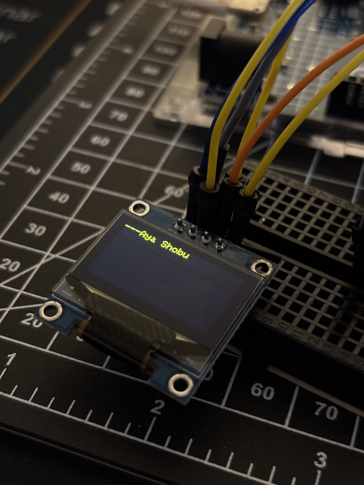
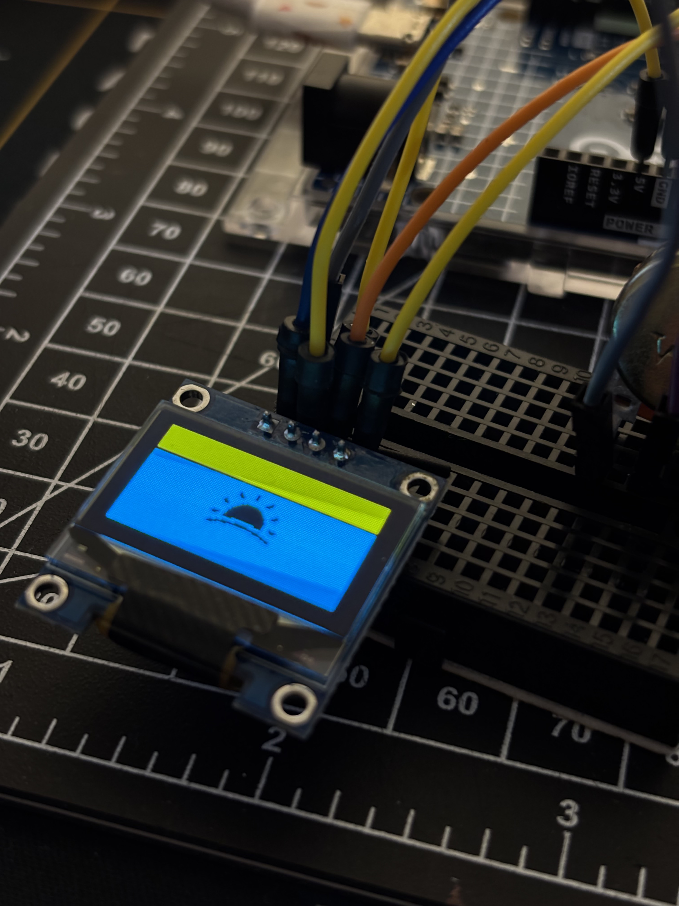

# proyecto-01

## Acerca del proyecto

- Grupo: 06
- Nombre de grupo: brainrot
- Integrantes:
  - Sofía Cartes / [sofiacartes](https://github.com/sofiacartes)
  - Antonia Fuentealba / [AntFuentealba](https://github.com/AntFuentealba)
  - Sofía Perez / [sofia-perezm](https://github.com/sofia-perezm)
  - Valentina Ruz / [vxlentiinaa](https://github.com/vxlentiinaa)

## Presentación textual

El proyecto consiste en un dispositivo interactivo desarrollado con Arduino UNO R4 Minima que muestra poemas en una pantalla OLED. A través del giro de un potenciómetro, el usuario puede recorrer tres fases:

1. Visualización del poema en formato de espiral.

2. Presentación del nombre del autor.

3. Exhibición de un dibujo que representa el poema.

Cada uno de los 4 integrantes del equipo diseñó su propio poema y dibujo, compartiendo la misma estructura de código pero con variaciones en el contenido textual y gráfico. Los poemas son:

- Tras una gran
  
  bocanada de aire…
 
  Un llanto desconsolado.

Ikeda Sumiko [1936. - ]

- Cerezo invernal

  Lo vi tan desolado

  y me detuve.

Kajin Aioigaki [1898-1985]

- Florece el cosmos
  
  al amanecer…
  
  Soledad.
  
Aya Shōbu [1924-2005]

- Noche de otoño…
  
  Se marchita el corazón,
  
  un espejo en la mano.
  
Tōshi Akao [1925-1981]

## Inputs y outputs

### Input

Movimiento del potenciómetro, que determina el avance entre las fases de visualización.

### Output

- Poema en espiral en la pantalla OLED.
- Nombre del autor.
- Animación o imagen que simboliza el contenido del poema.

Se interactúa al mover la perilla del potenciómetro, el cual nos da tres posibilidades de ver en la pantalla.

Las siguientes opciones:

El poema, el autor y un símbolo relacionado a este.

Con este resultado decidimos hacer una serie de Haikus, para dar mayor visibilidad a estos poemas, incorporamos 4 códigos distintos, para que en 4 pantallas vieran distintos poemas y símbolos.

## Bocetos de planificación

Fotografías y dibujos de maquetas y pruebas

### Fórmula del espiral

La sacamos de una fórmula matemática llamada espiral logarítmica, donde un estudiante de informática nos ayudó a resolverla e implementarla en el código para entenderla mejor.

(r=a∙b⁰) donde "r" es la distancia desde el centro al origen.

[Espiral logarítmica](https://www.edificacion.upm.es/geometria/JPA/EspLog.html)

## Etapas del código

### 1. Inicialización del hardware

- Inclusión de librerías de la pantalla OLED.
- Configuración del potenciómetro y variables de control.

```cpp
// Wire.h sirve para que el arduino se comunique con otros aparatos
// Adafruit_GFX sirve para dibujar, como lineas, circulos y letras
// Adafruit_SSD1306 sirve para manejar mejor las pantallas pequeñas
// math.h sirve para hacer los espirales, utilizando cos() y sin()
#include <Wire.h>
#include <Adafruit_GFX.h>
#include <Adafruit_SSD1306.h>
#include <math.h>

// Acá definimos las medidas de la pantalla
#define SCREEN_WIDTH 128
#define SCREEN_HEIGHT 64
#define OLED_RESET -1
Adafruit_SSD1306 pantallita(SCREEN_WIDTH, SCREEN_HEIGHT, &Wire, OLED_RESET);

int potPin = A0; // Pin del potenciómetro
```

### 2. Dibujo del poema en espiral

- Función que coloca cada palabra o verso en coordenadas calculadas para formar la espiral.

```cpp
// Poema en espiral
String poema = "Noche de otoño… Se marchita el corazón, un espejo en la mano.";
```

```cpp
if(valor <= 341){
    // float sirve para declarar numeros decimales, estos numeros hace que el poema este en espiral
    float centroX = SCREEN_WIDTH / 2; // este sirve para calcular la mitad de la pantalla
    float centroY = SCREEN_HEIGHT / 2; // este sirve para calcular la mitad de la pantalla
    float angulo = 0;
    float radio = 8; // Radio inicial del espiral
    float pasoAngulo = 0.4; // Separacion del angulo, cuanto avanza en cada letra
    float pasoRadio = 0.6; // Cuanto se aleja del centro cada vez mas

// for es la iteracion, es decir que en este caso recorre letra por letra para que aparezca en la pantalla
    for (int i = 0; i < poema.length(); i++) {
      char c = poema.charAt(i);
      int x = centroX + radio * cos(angulo); // aqui se calcula en que posicion del espiral va cada letra
      int y = centroY + radio * sin(angulo);

      pantallita.setCursor(x, y);
      pantallita.write(c);
      pantallita.display(); // sirve para mostrar el "calculo" del espiral en la pantalla

// cuanto avanza en el espiral, es decir, que el angulo 0 va aumentando 0.4 cada vez que avanza y lo mismo con el radio
      angulo += pasoAngulo;
      radio += pasoRadio;
      delay(80); // es el tiempo en que van apareciendo las letras
    }
```

### 3. Visualización del nombre del autor

- Texto centrado o en movimiento para destacarlo.

```cpp
// Nombre autor
String mensaje = "--- Tōshi Akao";
```

### 4. Animación/dibujo representativo**

- Uso de arrays de bits (drawBitmap) para mostrar imágenes o secuencias de frames.

```cpp
const unsigned char hojassecas [] PROGMEM = {

// Este codigo lo obtuvimos de image2cpp

 	0xff, 0xff, 0xff, 0xff, 0xff, 0xfe, 0xff, 0xff, 0xff, 0xff, 0xff, 0xff, 0xff, 0xff, 0xff, 0xff, 
```

En esta parte va la respectiva imagen de cada integrante del grupo

### 5. Control por potenciómetro

- Lectura del valor analógico y cambio de etapa según la posición.

```cpp
int valor = analogRead(potPin);
```

```cpp
  // else sirve para ejecutar una condición, si if cumple, se ejecutara else
  // es decir, que si el valor del potenciometro es menor a 682 mostrara el texto en espiral
  }
  else if(valor <= 682){
    // Mostrar texto en espiral
    pantallita.setTextSize(0.3);
    pantallita.setCursor(0, 0);
    pantallita.println(mensaje); // aqui se muestra el nombre del autor
    pantallita.display();
    delay(1000);
  }
  // este else no tiene () porque no cumple una condicion para que suceda, entonces si el valor es mayor a 682, se mostrara la imagen
  else{
    // Mostrar imagen 
    pantallita.drawBitmap(0, 0, hojassecas, 128, 64, WHITE);
    pantallita.display();
    delay(1000);
  }
}
```

## Roles del equipo

### Sofía Cartes y Valentina Ruz

- Encargadas de modificar el código de referencia e implementar el potenciómetro; también buscar las fórmulas para que aparezca el texto en espiral.
- Investigar sobre tipos de códigos y fórmulas.
- Redacción de GitHub.
- Registro fotográfico del proceso.
  
### Antonia Fuentealba y Sofía Perez

- Investigación de poemas y sus tipos.
- Investigación de imágenes con vectores que calzaran con los poemas.
- Redacción de GitHub.
- Registro fotográfico del proceso.

## Fotografías y videos del proyecto funcionado

Subir fotos y videos

El video debe estar subido a youtube y mencionado en un enlace para ahorrar espacio en el repositorio
### poema 1:
### poema 2:
### poema 3:






### poema 4:

## Bibliografía

Citas en APA de repositorios y enlaces de los cuales se inspiraron. Bibliotecas, tutoriales, etc.

* 575筆まか勢 (Fudemaka57). (s.f.). 575筆まか勢 (Blog). Recuperado el 28 de agosto de 2025, de <https://fudemaka57.exblog.jp/>
* Kramer, L. (17 de abril, 2025). A guide to haiku: Definition, structure, and examples. Grammarly. Recuperado de <https://www.grammarly.com/blog/creative-writing/how-to-write-haiku/>
* El proyecto (Project 440360994230097921) Wokwi ESP32, STM32, Arduino Simulator. (26 de agosto, 2025). Wokwi. Recuperado el 28 de agosto de 2025, de <https://wokwi.com/projects/440360994230097921>
* Wokwi.(s.f.). Wokwi OLED Animation Maker for Arduino. <https://animator.wokwi.com/>
* Pardo Martín, C. F.(2025). Dibujar una espiral. Picuino. <https://www.picuino.com/es/scratch-espiral.html>
* Evans, B.W.(2007). Manual de programación Arduino(PDF). Traducido y adaptado por J. M. Ruiz Gutiérrez. PBworks. <https://arduinobot.pbworks.com/f/Manual+Programacion+Arduino.pdf>
  
### Repositorios
* Adafruit Industries. (s.f.). Adafruit. GitHub. <https://github.com/adafruit>
* sofiacartes.(s.f.). 05-sofiacartes [Carpeta dentro del repositorio dis8645-2025-02-proceso]. GitHub. <https://github.com/sofiacartes/dis8645-2025-02-procesos/tree/main/05-sofiacartes>
* AntFuentealba.(s.f.). 11-AntFuentealba [Carpeta dentro del repositorio dis8645‑2025‑02‑procesos]. GitHub <https://github.com/dis8645-2025-02-procesos/tree/main/11-AntFuentealba>
* sofiaperezm.(s.f.). 22-sofia-perezm [Carpeta dentro del repositorio dis8645‑2025‑02‑procesos]. GitHub. <https://github.com/dis8645-2025-02-procesos/tree/main/22-sofia-perezm>
* vxlentiinaa. (s.f.). 26-vxlentiinaa [Carpeta dentro del repositorio dis8645‑2025‑02‑procesos]. GitHub. <https://github.com/vxlentiinaa/dis8645-2025-02-procesos/tree/main/26-vxlentiinaa>
