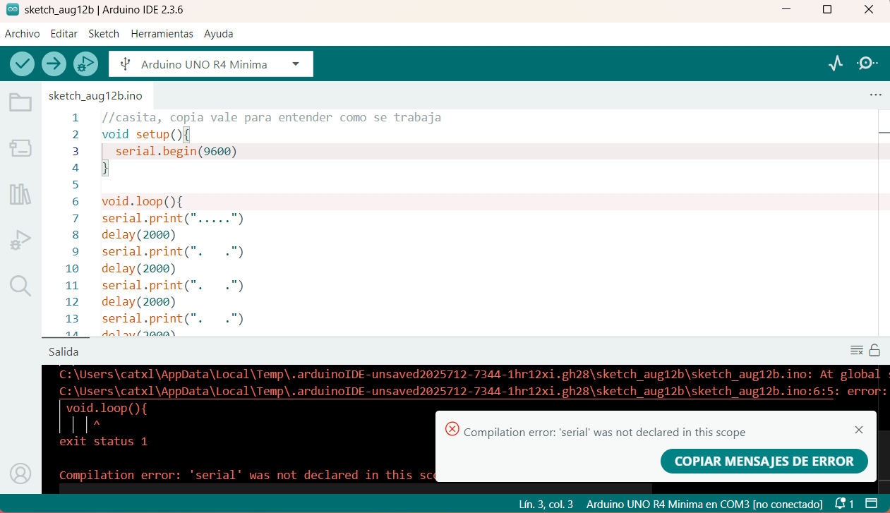

# sesion-01b

Viernes 08, Agosto - 2025

Nota del día: no fui a la clase porque estaba enferma, así que ando algo perdida con la materia.

## ARDUINO IDE
>**Consideraciones del programa**

- "Interfaz grafica, tiene varios software que conviven entre si"
  
una plataforma de hardware y software de código abierto que permite construir proyectos electrónicos interactivos

- **IDE:** entorno de desarrollo integrado.
- **circulo con ticket:** para verificar el código.
- **circulo con flecha:** para enviar el código a la placa por el cable usb; esto activa el funcionamiento de lo que se realizó en el código.
- **cuadrado con lupa y puntos:** "serial motor" o monitor de serie. todo lo que tenga serial o secuencia pasa por aquí.
- **para abrir la configuración de ARDUINO (para editar por ejemplo la apariencia o el idioma):** CTRL + , (coma)
  
>**En la placa: ARDUINO UNO R4 MINIMA BOARD**

- **botón:** "reset"

Si se aprieta se resetea, se apaga y se vuelve a prender. Si se aprieta 2 veces el botón se olvida de todo lo que se haya transmitido anteriormente.

>**Nomenclatura**

() - parentesis

[] - corchetes

{} - corchetes/"Murciélagos"

>**Funciones y códigos**

// - para anotar comentarios, organizar, etc. No interfiere con el código, solo se pone al inicio de la frase y queda en gris.

/* - abrir comentarios

*/ - cerrar comentarios

() - funciones, se debe poner pegado al comando (color naranjo)

; - despues de cada parentesis va un punto y coma, es importante ponerlo!

{} - declarar algo/código bruto

"" - sirve para anotar algo que quiero que se reproduzca dentro del código; el caracter hay que ponerlo en el codigo entre las comillas.

= - el igual es no comunicativo, es más bien referente a que el lugar de la izquierda (antes de) adentro tiene el lado derecho (despues de)

ej: hola = huevito

entonces en el lugar de hola existe el huevito (el valor huevito).

>**Palabras claves**

- **Delay: "congelao"**

le da al arduino un paro o descanso, significa que el arduino le manda la señal y se queda ahí por un segundo.
es importante porque evita que se queme la placa.

Yo decido el tiempo de espera de una señal/información con otra (en multiplos de 1000 o derivados, ej: 3000 es igual a 3 segundos)

- **Float** - para decimales
- **Bool** - si/no
- **Char** - solo 1 letra/un caracter (_)
- **string** - más de un caracter (_)
- **serial.begin ();**
  
el "." te da posibilidades dentro del programa (tipo menu, desgloce de opciones dentro del arduino como código)

"()" se le asigna un vaor númerico que refiere a la velocidad

## TAREA

- códigos e intentos.

nota: realmente no entendia que estaba haciendo.
