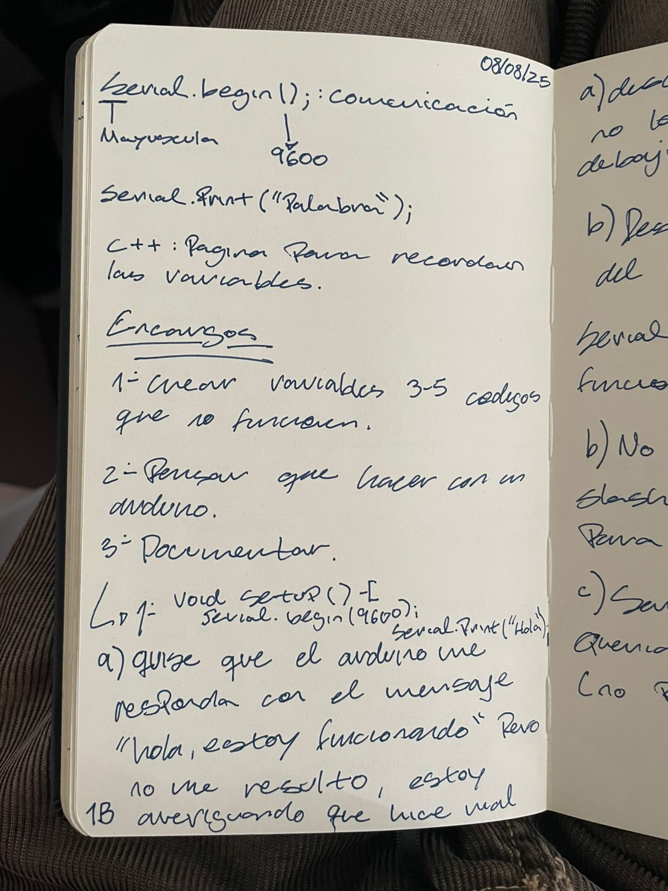
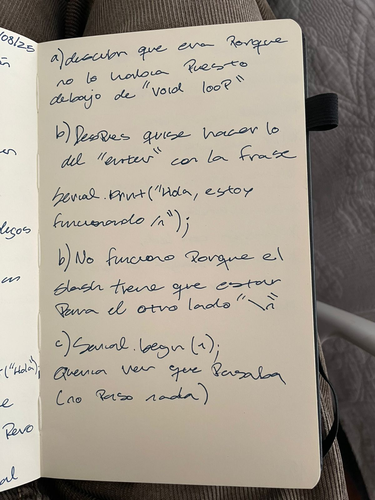

# sesion-01b


# Apuntes – Funciones Gmail y Arduino

## Gmail
- **BCC**: Envía el correo a varios destinatarios sin que vean las direcciones entre ellos.
- **CC**: Envía una copia del correo a otra persona.
- **Reply All**: Responde a todos los destinatarios del correo original.


## Arduino

### Conceptos Básicos
- Al presionar **reset**, la placa se reinicia (apaga y enciende).
- Si se presiona dos veces, se borra la información previa.
- Los valores dentro de paréntesis son **parámetros**.
- El orden de las declaraciones no altera la verificación del código.
- Los datos se almacenan en la memoria.


### ¿Qué es Arduino?
- Plataforma **open-source** de hardware y software para proyectos electrónicos interactivos.
- Incluye:
  - Placa programable (**microcontrolador**).
  - IDE (**Integrated Development Environment**) para programar.
- Lenguaje usado: **C++** (con soporte para programación orientada a objetos).


### Elementos del Lenguaje
- **Serial Monitor**: Muestra la comunicación serial.
- **Símbolos**:
  - `()` Paréntesis
  - `[]` Corchetes
  - `{}` Llaves (o “murciélagos”)
  - `//` Comentario
  - `;` Fin de línea
  - `=` Asignar valor
  - `==` Comparar valor
  - `HIGH / LOW` Estados digitales (1 / 0)


### Tipos de Datos
- `int` → Números enteros.  
- `float` → Números decimales.  
- `char` → Un solo carácter.  
- `String` → Conjunto de caracteres (texto).  
- `bool` → Valores lógicos (true / false).


### Funciones Principales
#### setup()
Se ejecuta una sola vez al iniciar o reiniciar la placa.
```cpp
void setup() {
  pinMode(4, OUTPUT); // Configura pin 4 como salida
}
```
#### loop()
Se ejecuta de manera continua e indefinida.
```cpp
void loop() {
  digitalWrite(13, HIGH);
  delay(1000);
  digitalWrite(13, LOW);
  delay(1000);
}
```
#### pinMode()
Configura un pin como entrada o salida.
```cpp
pinMode(13, OUTPUT); // Pin 13 como salida
```

#### digitalWrite()
Envía señal HIGH o LOW a un pin.
```cpp
digitalWrite(13, HIGH); // Enciende LED
```

#### delay()
Pausa la ejecución del código por un tiempo (ms).
```cpp
delay(1000); // Espera 1 segundo
```
### Ejemplo Completo
```cpp
String poema = "te regalare un abismo";

void setup() {
  pinMode(LED_BUILTIN, OUTPUT);
  Serial.begin(9600);
}

void loop() {
  Serial.print(poema);
  Serial.print("\n");
  digitalWrite(LED_BUILTIN, HIGH);
  delay(200);
  digitalWrite(LED_BUILTIN, LOW);
  delay(200);
}
```

---

## Encargo
1. Programar y equivocarse 3 veces, documentar textualmente
2. Programar y equivocarse 3 veces, documentar visualmente





