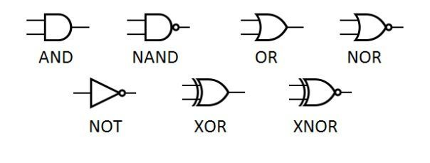

# sesion-03a

## 19-agosto-2025 - clase 5

### proyecto-01

- 1 punto base

#### parte grupal

- 1 punto por documentación textual de todo el proyecto
- 1 punto por calidad de comentarios del código
- 1 punto por factura, funcionalidad y originalidad

#### parte individual

- 1 punto por bitácora constante, periódica y personal
- 1 punto por presentación de cada estudiante
- 1 punto por definir los roles que tomaste en el grupo

#### descuentos

- 3 puntos por entregar tarde
- 3 puntos menos por no presentar (sin justificativo médico)
- 5 puntos menos por falta de comentarios en el código
- 6 puntos menos si se presenta sin documentación del proceso
- 3 puntos menos por hacer el mínimo esfuerzo respecto a la capacidad/características de los componentes


### clase

hoy veremos condicionales.

el if sirve para correr ciertas partes del codigo siempre que se cumplan ciertas condiciones.

con else y else if podemos expandir las posibilidades,

#### ejemplo: 

```cpp
if(saldo>250){
 abrirTorniquete();
}else{
 Serial.println("SALDO INSUFICIENTE")
}
```

### links

- [if( )](https://docs.arduino.cc/language-reference/en/structure/control-structure/if) 

- [else{ }](https://docs.arduino.cc/language-reference/en/structure/control-structure/else)

- [&&](https://docs.arduino.cc/language-reference/en/structure/boolean-operators/logicalAnd)

- [||](https://docs.arduino.cc/language-reference/en/structure/boolean-operators/logicalOr)

### extras 

- [David Hume](https://es.wikipedia.org/wiki/David_Hume)

## códigos trabajados en clase

```cpp
//bool prender = false;
bool prender = true;

void setup() {
pinMode(LED_BUILTIN, OUTPUT);
}

void loop() {
  digitalWrite(LED_BUILTIN, prender);
  delay(3000);
  prender = false;
  digitalWrite(LED_BUILTIN, prender);
}
```

en el anterior ocupamos delay( ), lo cual no es muy recomendado.

```cpp
bool prendido = false;

void setup() {
  pinMode(LED_BUILTIN, OUTPUT);
  Serial.begin(9600);
}

void loop() {
  //Serial.println(millis() / 1000);
unsigned long segundos = millis() / 1000;

  // con este if, el led se prende durante 3 segundos y luego se apaga
  if (segundos < 3) {
    prendido = true;
  }/* else if (segundos > 10) {
    prendido = true;
  } */else {
    prendido = false;
  }

  digitalWrite(LED_BUILTIN, prendido);
}
```

### operadores lógicos

- AND: inputs mutuamente dependientes **&&**

- OR: inputs independientes **| |**

- NOT: es un inversor **!**




## for( )

```cpp
for(x,y,z){
 hacer();
}
```
en es codigo, **z** solo se le una vez ya corrió lo que está dentro de los murciélagos. **x** define el valor inicial, y **y** define cuando se terminará de loopear el for

```cpp
for(int i=0; i< veces; i = i+1){
  hacer();  
}
```

dentro del for existe la **i**, cuando se salga del for dejará de existir.

### modulos

modulo se le llama al resto de una división, y se escribe con el símbolo **%**

```cpp
x/n = y
```

en este caso el módulo siempre será (n - 1)

cuando uno hace una división de enteros hay 2 resultados importantes, la división y el resto(módulo).

- si escribo **7 / 2**, me entrega la división 
- si escribo **7 % 2** me entrega el módulo

con el siguiente código, con ayuda del módulo podemos hacer el led parpadear el led

```cpp
//QUIERO PODER DECIRLE A ARDUINO
//EN EL MONITOR SERIAL
//CADA CUANTO TIEMPO PARPADEE EL LED
bool estadoLed = 0;
int numero1 = 6;

void setup() {
  pinMode(LED_BUILTIN, OUTPUT);
  Serial.begin(9600);
}

void loop() {
  unsigned long segundos = millis() / 1000;

  int numero2 = 2;
  int division;
  int resto;

  division = numero1 / numero2;
  resto = numero1 % numero2;
  //EL RESULTADO VA A SER "2", NO "2.5"
  Serial.print("numero1 es ");
  Serial.print(numero1);
  Serial.print(" y el modulo al dividir por 2 es ");
  Serial.println(resto);

  //voy a incrementar numero1 de 1 en 1
  numero1++;
  
  if (segundos%2 == 0){ //si es un segundo par
    estadoLed = false;
  } else {
    estadoLed = true; ////si es un segundo impar
  }

  digitalWrite(LED_BUILTIN,estadoLed);
}
```

### encargo

investigar NAND, NOR, XOR
