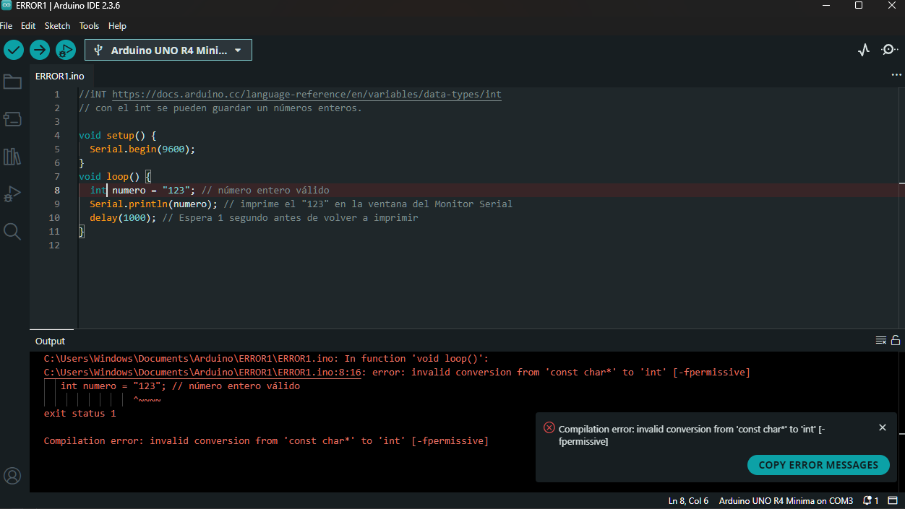

# sesion-01b


## encargo

Crear variables y fallar. 3 codigos que no funciones y registrarlos. 


### Error 1

Quería imprimir el número 123 en el serial monitor, repitiendo 123 cada 1 segundo. Con el int es para guardar un número entero.

```cpp
//iNT https://docs.arduino.cc/language-reference/en/variables/data-types/int
// con el int se pueden guardar un números enteros.

void setup() {
  Serial.begin(9600);
}
void loop() {
  int numero = "123"; // número entero válido
  Serial.println(numero); // imprime el "123" en la ventana del Monitor Serial
  delay(1000); // Espera 1 segundo antes de volver a imprimir
}
```


### Error 2 

Modifique el codigo de efemplo de Serial.readString(), el cual lee las palabras qque se envían a través del puerto serial y los guarda como una conversación.
```cpp
//https://docs.arduino.cc/language-reference/en/functions/communication/serial/readString
//Quiero crear una conversacion con distintas respuestas en el serial monitor

void setup() {
  Serial.begin(9600);
}

void loop() {
  Serial.println("Enter data:");
  while (Serial.available() == 0) {}     //wait for data available
  String teststr = Serial.readString();  //read until timeout
  teststr.trim();                        // remove any \r \n whitespace at the end of the String
    if (teststr == "hola"); { 
    Serial.println("Como estas");
  } else if (teststr == "chau") {
    Serial.println("hasta luego");
  } else {
    Serial.println("que tal");
  }
}
```

