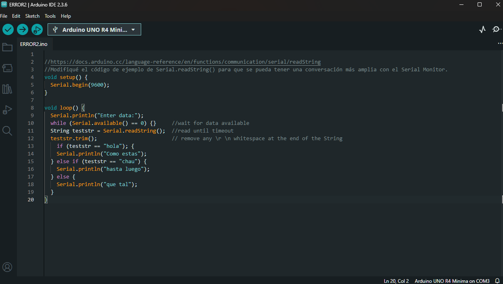

# sesion-01b

## Apuntes

### Arduino
- A modo de intruccion en el como comunicarse a la gente nueva del curso, se les mostró como hacer envio de correo de una manera correcta. 
- Comenzamos a utilizar arduino.
- Instalamos Arduino IDE
- Instalar el Board Manager de placa R4.
- Conectar cable usb tipo c y seleccionar dispositivo en barra superior.
- En FILE se pueden encontrar examples como Blink.

````CPP
// the setup function runs once when you press reset or power the board
void setup() {
  // initialize digital pin LED_BUILTIN as an output.
  pinMode(LED_BUILTIN, OUTPUT);
}

// the loop function runs over and over again forever
void loop() {
  digitalWrite(LED_BUILTIN, HIGH);  // turn the LED on (HIGH is the voltage level)
  delay(1000);                      // wait for a second
  digitalWrite(LED_BUILTIN, LOW);   // turn the LED off by making the voltage LOW
  delay(1000);                      // wait for a second
}
````
- Comentarios //linea 
// línea individual
- setup() se hace solo 1 vez al encender.
- loop() repite siempre lo que quieres que pase todo el tiempo.

### Comandos y funciones comunes

- Serial.begin(9600) → inicia comunicación serial
- Serial.print(variable) → muestra datos en consola
- \n → nueva línea en consola. FRANUDP ME AYUDO CON ESTO

## encargo

Crear variables y fallar. 3 codigos que no funciones y registrarlos. 


### Error 1

Quería imprimir el número 123 en el serial monitor, repitiendo 123 cada 1 segundo. Con el int es para guardar un número entero.

```cpp
//iNT https://docs.arduino.cc/language-reference/en/variables/data-types/int
// con el int se pueden guardar un números enteros.

void setup() {
  Serial.begin(9600);
}
void loop() {
  int numero = "123"; // número entero válido
  Serial.println(numero); // imprime el "123" en la ventana del Monitor Serial
  delay(1000); // Espera 1 segundo antes de volver a imprimir
}
```


### Error 2 

Modifique el codigo de ejemplo de [Serial.readString()](https://docs.arduino.cc/language-reference/en/functions/communication/serial/readString), el cual lee las palabras que se envían a través del puerto serial y los guarda como un string.
```cpp
//https://docs.arduino.cc/language-reference/en/functions/communication/serial/readString
//Quiero crear una conversacion con distintas respuestas en el serial monitor

void setup() {
  Serial.begin(9600);
}

void loop() {
  Serial.println("Enter data:");
  while (Serial.available() == 0) {}     //wait for data available
  String teststr = Serial.readString();  //read until timeout
  teststr.trim();                        // remove any \r \n whitespace at the end of the String
    if (teststr == "hola"); { 
    Serial.println("Como estas");
  } else if (teststr == "chau") {
    Serial.println("hasta luego");
  } else {
    Serial.println("que tal");
  }
}
```


### Error 3 

Esto no es tanto un error, pero igual es algo que, para mí, genera un conflicto leve. Pido perdón por esto, pero no se me ocurría qué más hacer, así que simplemente fui jugando con un ejemplo y viendo qué pasaba. Al modificar el ejemplo Blink y cambiar el high-low a high-high, ocurría que:

```cpp
 digitalWrite(LED_BUILTIN, HIGH);  // turn the LED on (HIGH is the voltage level)
  delay(1000);                      // wait for a second
  digitalWrite(LED_BUILTIN, HIGH);   // turn the LED off by making the voltage LOW
  delay(1000);                      // wait for a second
}
```
[](https://youtu.be/3wDIDZGPhik)

La primera línea digitalWrite(LED_BUILTIN, HIGH) enciende el LED, mientras que la segunda línea digitalWrite(LED_BUILTIN, HIGH) intenta encender el LED de nuevo, pero como ya estaba encendido, no hay un cambio. Resultando en que El resultado es que el LED se enciende al principio y nunca vuelve a recibir la instrucción de apagarse.
