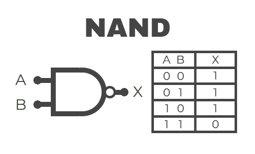

# sesion-03a

## APUNTES 19.08.25

### Condicionales, iteradores, Serial.read(), protoboard

Operadores lógicos: permiten operar y realizar preguntas de sí y no. En cada lenguaje se escriben distinto.

```ccp
If (Boolean condition) Then
  (consequence)
  Else
    (alternative)
  End if
Si (asistencia, condición) entonces
print ("pasaste")
En cualquier otro caso
print ("nope")
Ejemplo:
if (estaLloviendo == true) {
   hacerSopaipillas();
}
else {
  salirAAndarEnBici();
---------
}
if (ver == false) {  
   ponermeLentes();
if (suciedad == true){   //condición dentro de otra condición, se puede hacer.
   limpiarLentes();
}
}
else{
continuarConMiVida();
}
//equivale a ¿es ver falso?, si la respuesta es sí, ponerme lentes, si la respuesta es no, continuar con mi vida.
```

```ccp
!: bank, significa lo contrario a.
ejemplo:
//si no hay arana
//reacciono tranqui
if (!hayArana) {
   reaccionarTranqui();
}
else {
chillar(infinito);
}
```

```ccp
if (edad >= 18 AND edad <=80 ) {
  dartePermisoConducir();
}
else {
noPuedoNoMas();
}
```

- millis() cuenta el tiempo desde que se prendió el arduino.
si crean variables con millis(), que sean declaradas con   unsigned long

---

```ccp
OPERADORES LÓGICOS
o/ or    /    no/not       /   y/ and
La compuerta and solo es 1 cuando las dos variables estan en 1, en cualquier otro caso es 0 (&&)
La compuerta or, si alguna de las entradas es sí, la respuesta es sí, si ambas es no la respuesta es no (||)
La compuerta not, la respuesta a la entrada siempre va a ser contraria (!)
El orden de los operadores lógicos no cambia el resultado (son conmutativos)
```

## INVESTIGAR: NAND, NOR, XOR

```ccp
Iterar
//cuantas veces quieren repetir algo
//se itera con for
//se pone entre parentesis 3 cosas:
//1 partida
//2 termino
//3 actualizaciones
//y entre murcielagos {} lo que quiero iterar
int repeticiones/veces; 
for (parto; termino; que hago cada paso)
{
hazEsto();
}
ej:
for (int i = 0; i < veces; i = i + 1)

```

### NAND

[Link de donde saqué la información](https://www.mecatronicalatam.com/es/tutoriales/electronica/compuertas-logicas/compuerta-nand/)

```ccp
NAND es una compuerta lógica, que combina la compuerta AND Y NOT y en su representación tiene un círculo en la salida.
En su tabla de verdad, el resultado siempre será 1 excepto cuando ambas entradas sean 1, en ese caso es 0.
```


### NOR

[Link de donde saqué la información](https://www.mecatronicalatam.com/es/tutoriales/electronica/compuertas-logicas/compuerta-nor/)

```ccp
NOR es una compuerta lógica combinación de las compuertas OR y NOT, también equivaliendo a la inversa de la compuerta OR.
Tiene sus entradas inactivas, por lo que la salida estará en estado activo.
Si alguna de las entradas se activa "1", la salida pasará a estar inactiva "0".
```

### XOR

[Link de donde saqué la información](https://www.mecatronicalatam.com/es/tutoriales/electronica/compuertas-logicas/compuerta-xor/)
[Link de donde saqué la información](https://www.ebsco.com/research-starters/science/boolean-expression)

```ccp
XOR, o también conocida como "OR EXCLUSIVA", es llamada la compuerta "de algunos, pero no de todos".
Su expresión booleana ( proposición lógica utilizada en informática que evalúa un valor booleano,
que puede ser verdadero o falso.)
Su salida será 0 en caso de que sus entradas tengan el mismo valor: "1"+"1" o "0"+"0",
y tendrá salida 1 en caso de que las entradas sean distintas.
```
