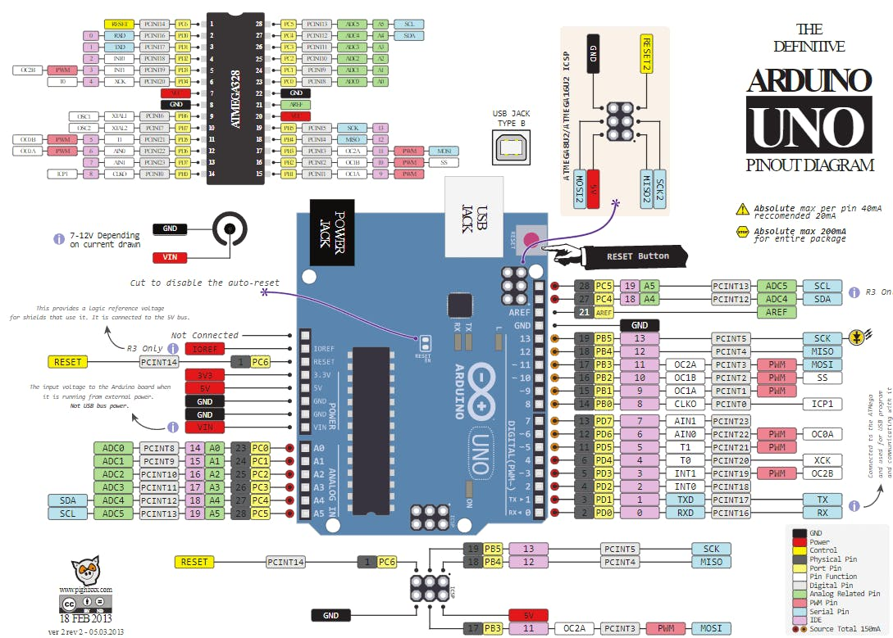

# sesion-03a

## Cómo poner imágenes en github


## Pantallas y píxeles

Nos importa la resolución, el tamaño y el chip.

Referentes:  
<https://www.artesmediales.uchile.cl/academico/daniel-cruz/>  
<https://arteymedios.org/daniel-cruz/>  
Charla: <https://www.nucleofair.org/agenda/coloquio-posthumanamente-hablando-ii/>

### Encargo

Navegador de poemas  
Si ocupo un código base de ejemplo, documentar en el encargo y separar lo que es del ejemplo y lo que hice yo.  
Robar, modificar y citar.  

Plataforma: <https://www.tinkercad.com/>

*Protocolo I2C* (4 puntos de conexión)  
Nos permite, con menos hardware, conectar distintos dispositivos en paralelo.  
Comunicación síncrona.  
Nos simplifica las formas de conectar las cosas entre sí.  

*4 cables*:  
* gnd: El de tierra (verde), 0 volts, de acá comenzamos a contar los voltajes.  
* vcc: Voltaje de alimentación. 5V  
* scl: Clock — señal de reloj  
* sda: Datos  

La pantalla no recibe información, la emite.  

*unsigned (u)*  

Si queremos expandir nuestro Arduino: **Libraries**  
  

Entrevista:  
<https://github.com/readme/stories/limor-fried>  

Esos números son hexadecimales que significan otras cosas en binario:  
0x3C = 0111100  
0x3D = 0111101  
Solamente un elemento por dirección.  

Cuestionarse y entender límites materiales.  
<https://www.wolframalpha.com/>  

Para poner imágenes:  
<https://javl.github.io/image2cpp/>  
Transformar a bytes, importante la resolución.  
Pegar en código, antes de setup:  

```cpp
const unsigned char (name)[] PROGMEM = {
```
String linea(nº)
dentro de setup:
linea(nº)= que dice

[] para decir el lugar

ejemplo: <https://docs.arduino.cc/language-reference/en/variables/data-types/string/>

array: arreglo - Arreglo pared, variable ladrillos.
For: Para secuencia.
