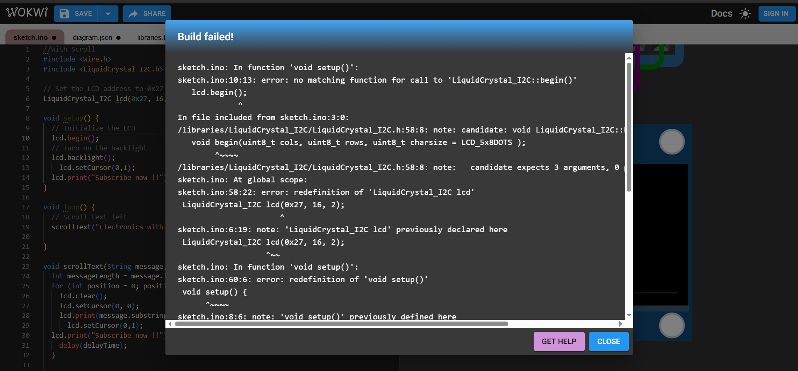
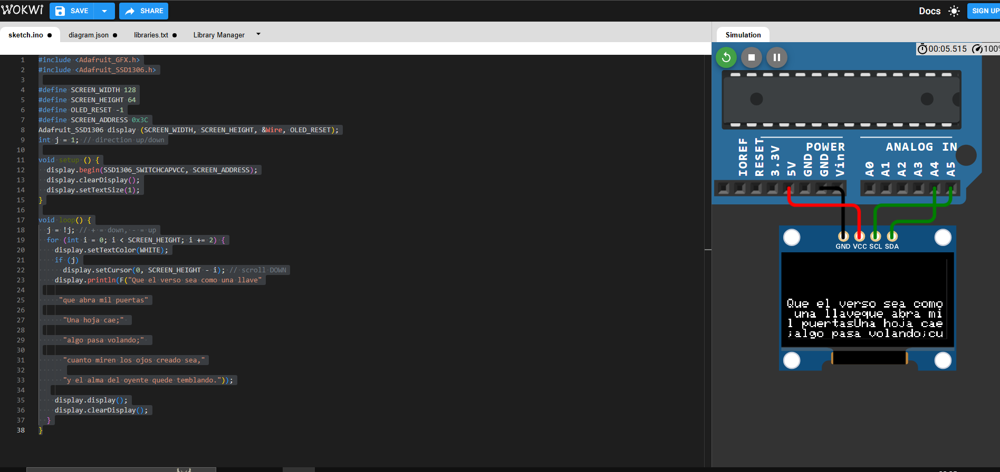

# sesion-03b

## Finalmente pude entender de que trata el encargo ☆(>ᴗ•)

---

Ok, poniendo los pies sobre el suelo. La idea es que una pequeña pantalla logre transmitir un poema.

en mi busqueda de codigos que puedan ayudarme, encontre algunos foros.

<https://arduino.stackexchange.com/questions/71121/how-to-get-text-to-flash-on-ssd1306-i2c-screen>

```cpp
#include <SPI.h>
#include <Wire.h>
#include <Adafruit_GFX.h>
#include <Adafruit_SSD1306.h>

#define SCREEN_WIDTH 128 // OLED display width, in pixels
#define SCREEN_HEIGHT 32 // OLED display height, in pixels

// Declaration for an SSD1306 display connected to I2C (SDA, SCL pins)
#define OLED_RESET     4 // Reset pin # (or -1 if sharing Arduino reset pin)
Adafruit_SSD1306 display(SCREEN_WIDTH, SCREEN_HEIGHT, &Wire, OLED_RESET);


void setup() {
 Serial.begin(9600);

  // SSD1306_SWITCHCAPVCC = generate display voltage from 3.3V internally
  if(!display.begin(SSD1306_SWITCHCAPVCC, 0x3C)) { // Address 0x3C for 128x32
    Serial.println(F("SSD1306 allocation failed"));
    for(;;); // Don't proceed, loop forever
  }

  // Show initial display buffer contents on the screen --
  // the library initializes this with an Adafruit splash screen.
  display.display();
  delay(2000); // Pause for 2 seconds

  // Clear the buffer
  display.clearDisplay();

  // Show the display buffer on the screen. You MUST call display() after
  // drawing commands to make them visible on screen!
  display.display();
  delay(2000);


  display.setTextSize(4);             // Draw 2X-scale text
  display.setTextColor(SSD1306_WHITE);

}

void loop() {
 testdrawstyles1();
 testdrawstyles2();
}


void testdrawstyles1(void) 
{
  display.clearDisplay();
  display.setCursor(0,0); 
  display.print(F("test1"));
  display.display();
  delay(500);
}

void testdrawstyles2(void) 
{
  display.clearDisplay();
  display.setCursor(0,0); 
  display.print(F("test2"));
  display.display();
  delay(500);
}
```
obviamente presenta un error que despues es corregido por otro usuario. el problema de este, ademas de que son textos muy pequeños. 

es la cantidad de lineas de codigo para hacer un poema entero

En mi caso logre ampliar el codigo uno más para mostrar otra frase

---


Un poco filosofico.

Como tal si funciona y lo muestra, pero viendo que el espacio es limitado es mejor no arriesgarse por esta opcion

---

## Segundo intento

Video de youtube con codigo incluido ¿que puede salir mal?

<https://www.youtube.com/watch?v=EFmrIceBkAs>

```cpp
//With Scroll
#include <Wire.h>
#include <LiquidCrystal_I2C.h>

// Set the LCD address to 0x27 for a 16 chars and 2 line display
LiquidCrystal_I2C lcd(0x27, 16, 2);

void setup() {
  // Initialize the LCD
  lcd.begin();
  // Turn on the backlight
  lcd.backlight();
    lcd.setCursor(0,1);
  lcd.print("Subscribe now !!");
}

void loop() {
  // Scroll text left
  scrollText("Electronics with Adwait ", 500);

}

void scrollText(String message, int delayTime) {
  int messageLength = message.length();
  for (int position = 0; position < messageLength; position++) {
    lcd.clear();
    lcd.setCursor(0, 0);
    lcd.print(message.substring(position, position + 16));
      lcd.setCursor(0,1);
  lcd.print("Subscribe now !!");
    delay(delayTime);
  }

  // Pause at the end of the message before scrolling back
  delay(2000);

  for (int position = 0; position < 16; position++) {
    lcd.clear();
    lcd.setCursor(0, 0);
    lcd.print(message.substring(messageLength - 16 + position, messageLength) + message.substring(0, position));
      lcd.setCursor(0,1);
  lcd.print("Subscribe now !!");
    delay(delayTime);
  }

  // Pause at the beginning of the message before scrolling again
  delay(500);
}


//Without Scroll
#include <Wire.h>
#include <LiquidCrystal_I2C.h>

// Set the LCD address to 0x27 for a 16 chars and 2 line display
LiquidCrystal_I2C lcd(0x27, 16, 2);

void setup() {
  // Initialize the LCD
  lcd.begin();
  // Turn on the backlight
  lcd.backlight();
  // Print a message to the LCD
  lcd.setCursor(0, 0); // Set cursor to column 0, row 0
  lcd.print("Electronics with");
  lcd.setCursor(5, 1); // Set cursor to column 0, row 1
  lcd.print("Adwait");
}


void loop() {
  // Nothing needed here for this example
}
```

Jaja



Tal vez no fue algo bueno, pero fallar es humano.

Pero entre todo eso, descubri que hay una manera de hacer scroll con estos 2 comandos que dejare por aqui

- autoscroll(): para hacer autoscroll al texto
- noAutoscroll(): para detenerlo

Actualizacion: estos errores pueden deberse (ya que estuve leyendo la pagina web que lo explica) a que la pantalla no es compatible, ya que se utiliza otro modelo de pantalla

<https://docs.arduino.cc/learn/electronics/lcd-displays/>

---

## La tercera es la vencida ⊂(･ω･*⊂)

<https://forum.arduino.cc/t/scrolling-a-oled-down/1403417/8>

```cpp
#include <Adafruit_GFX.h>
#include <Adafruit_SSD1306.h>

#define SCREEN_WIDTH 128
#define SCREEN_HEIGHT 64
#define OLED_RESET -1
#define SCREEN_ADDRESS 0x3C
Adafruit_SSD1306 display (SCREEN_WIDTH, SCREEN_HEIGHT, &Wire, OLED_RESET);
int j = 1; // direction up/down

void setup () {
  display.begin(SSD1306_SWITCHCAPVCC, SCREEN_ADDRESS);
  display.clearDisplay();
  display.setTextSize(1);
}

void loop() {
  j = !j; // + = down, - = up
  for (int i = 0; i < SCREEN_HEIGHT; i += 2) {
    display.setTextColor(WHITE);
    if (j)
      display.setCursor(0, SCREEN_HEIGHT - i); // scroll DOWN
    display.println(F("Que el verso sea como una llave"

     "que abra mil puertas"

      "Una hoja cae;" 

      "algo pasa volando;" 

      "cuanto miren los ojos creado sea,"
      
      "y el alma del oyente quede temblando."));
  
    display.display();
    display.clearDisplay();
  }
}
```

Modifique el codigo para que solo vaya para abajo y le cambie las frases.

Y claro, funciona pero...podria ser mucho mejor.
Lo llevare a la clase por si la opcion de usar el codigo que dio el profe no funciona o no convence



La idea es que el poema se vea...como un poema (￢ ￢) cof cof

---

Mañana vere si utilizo el codigo que dio el profesor y le dare una manita de gato. (Por lo tanto esto no es lo ultimo de mi)

## Actualización

Encontre otro codigo con el cual se puede mostrar de diferentes maneras el texto, lo cual es perfecto para darle una mejor visualidad al poema.

(https://programarfacil.com/blog/arduino-blog/ssd1306-pantalla-oled-con-arduino/)

```cpp
#include <SPI.h>
#include <Wire.h>
#include <Adafruit_GFX.h>
#include <Adafruit_SSD1306.h>
 
// Definir constantes
#define ANCHO_PANTALLA 128 // ancho pantalla OLED
#define ALTO_PANTALLA 64 // alto pantalla OLED
 
// Objeto de la clase Adafruit_SSD1306
Adafruit_SSD1306 display(ANCHO_PANTALLA, ALTO_PANTALLA, &Wire, -1);
 
void setup() {
#ifdef __DEBUG__
  Serial.begin(9600);
  delay(100);
  Serial.println("Iniciando pantalla OLED");
#endif
 
  // Iniciar pantalla OLED en la dirección 0x3C
  if (!display.begin(SSD1306_SWITCHCAPVCC, 0x3C)) {
#ifdef __DEBUG__
    Serial.println("No se encuentra la pantalla OLED");
#endif
    while (true);
  }
 
  // Limpir buffer
  display.clearDisplay();
 
  // Tamaño del texto
  display.setTextSize(1);
  // Color del texto
  display.setTextColor(SSD1306_WHITE);
  // Posición del texto
  display.setCursor(10, 32);
  //Activar página de código 437
  display.cp437(true);
  // Escribir el carácter ¡ dos veces
  display.write(173);
  display.write(173);
  // Escribir texto
  display.println("En Santiago");
  display.println("de Chile");

  
  
  // Enviar a pantalla
  display.display();
  delay(2000);
 
  // Mover texto de izquierda a derecha
  display.startscrollright(0x00, 0x0F);
  delay(5000);
  display.stopscroll();
  
  // Mover texto de derecha a izquierda
  display.startscrollleft(0x00, 0x0F);
  delay(5000);
  display.stopscroll();
 
  // Mover texto en diagonal hacia la derecha
  display.startscrolldiagright(0x00, 0x07);
  delay(5000);
  display.stopscroll();
 
  // Mover texto en diagonal hacia la izquierda
  display.startscrolldiagleft(0x00, 0x07);
  delay(5000);
  display.stopscroll();
}
 
void loop() {}
```

Con estas lineas de codigo se puede mover el texto a diferentes posiciones. No es largo y seria capaz de conversar con otras lineas mas complejas 
sin mandar a error todo el proceso.
