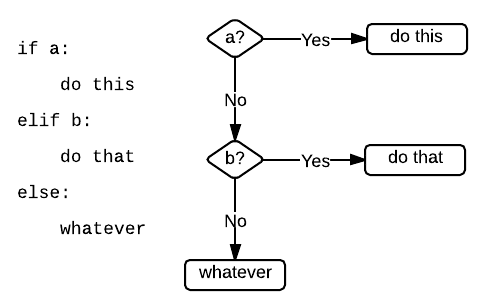

# sesion-03a

19 de agosto

- <https://isitchristmas.com/> - una página que dice si es navidad o no
- Pantalla OLED
- [millis en Arduino](https://docs.arduino.cc/language-reference/en/functions/time/millis/)

El viernes 29 de agosto tenemos entrega. Ver [00-proyecto-01](https://github.com/felix-rg416/dis8645-2025-02-procesos/tree/main/00-proyecto-01)

## Condicionales e iteradores

```cpp
if (Boolean condition) THEN
    (consequent)
else
    (alternative)
```



```cpp
if (estaLloviendo==true) {
    hacerSopaipillas();
}
else {
    salirAAndarEnBici();
}
```

```cpp
// si no hay arana
// reacciono tranqui
if (!hayArana){
    reaccionarTranqui();
}
else{
    chillar(volumen = infinito)
}
```

```cpp
// si mi edad es igual o mayor a 18
// y es menor a 80
if (edad >= 18 AND edad < 80){
// puedo conducir
    puedoConducir();
}
```

```cpp
// !
if (diciembre AND donFrancisco AND !godZilla AND !lecciones){
    teleton;
}
```

- Operadores lógicos --> OR - AND
- El ``else``es opcional
- = es para asiganr un valor
- == comparación - Es una pregunta ¿lo de la izquierda es igual a la derecha?
    - el else es si la respuesta a la pregunta anterior es NO

> "mientras más escribas más riego de equivocarme" ~Aarón

```cpp
// variable booleana
// la inicializamos falsa
bool prender = false;

void setup(){
// hacer que una patita sea OUTPUT
// usamos la constante incluida en Arduino
// LED_BUILTIN, porque sabe donde está el LED interno
  pinMode(LED_BUILTIN, OUTPUT);
}

void loop() {
  digitalWrite(LED_BUILTIN, prender);
}
```

```cpp
// el serialMonitor genera milisegundos
// en este caso, partido en 1000 para que sean segundos
Serial.println(millis() / 1000)
```

- long es para números muy grandes
    - unsigned long --> es para que parte desde el 0
    - si crean variables con `millis()`, que sean declaradas con  `` unsigned long``
