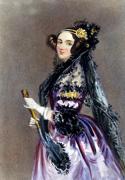
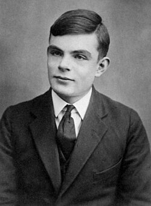

# sesion-01a

05-08-2025

## Apuntes 

- Artes Mediales
- Rafael Benguria --> Charlas TED
- Tiny Machine Learning

## ¿Qué es una máquina?

**Máquina -- Machina -- Mekhane -- artificio / ingenio / medio** 

- Objeto físico
- Capacidad de ejecutar procesos o correr
- Tiene un input y un output
- Piezas móviles
- Componentes electrónicos
- Requiere energía
- Tiempo: sustrato de la energía 
- Objetivo definido
- Compuesta por más de un elemento
- Intención
- Facilitar

**Computacionales** 

- Objeto físico
- Lenguaje
- Orden lógico: combinacional y secuencial
- Cómputo / número
- Datos / cálculo
- Interfaz --> HCI
- Información
- Algo que procesa información
- Transformar información 

HCI: Interfaz Humano Computador 

STS: Science Technology Sociality 

PCBA: La A significa "Assamble"

PCB SMT: PCB Pick and Place

## ¿Qué es un Microcontrolador?

- Es un circuito integrado programado
  - Un chip que no siempre hace lo mismo
- **Arduino**: Es una placa que dentro tiene un microcontrolador
  - Ocuparemos el Arduino Uno R4 minima

### Personas Importantes

- Muriel Cooper: Fue una pionera diseñadora de libros, diseñadora digital, investigadora y educadora.​ Ella fue la primera directora de diseño de la MIT Press, instalando un estilo influenciado por la Bauhaus en sus muchas publicaciones. ([Muriel Cooper](https://www.media.mit.edu/posts/muriel-cooper-lasting-imprint/))
- John Maeda: Ejecutivo estadounidense que lidera una nueva convergencia entre las industrias del diseño y la tecnología. ([John Maeda](https://www.media.mit.edu/people/maeda/overview/#:~:text=Juan%20Maeda&text=Orador%20y%20autor%20de%20renombre,Universidad%20de%20Tsukuba%20en%20Jap%C3%B3n.))
- Casey Reas: Un artista estadounidense cuyas obras de arte conceptuales, procedimentales y minimalistas exploran ideas a través de la lente contemporánea del software. ([Casey Reas](https://en.wikipedia.org/wiki/Casey_Reas))
- Hernando Barragán: Artista, diseñador y académico interdisciplinario colombiano conocido por crear la plataforma de desarrollo Wiring. ([Barragón](https://en.wikipedia.org/wiki/Hernando_Barrag%C3%A1n))
- Tom Igoe: Científico informático y artista estadounidense, mejor conocido como el creador de la plataforma electrónica de código abierto Arduino. ([Tom Igoe](https://wiki.yowu.dev/es/Knowledge-base/Dictionary/Person/tom-igoe-arduino-creator))
- Ada Lovelace: Matemática y escritora británica, célebre sobre todo por su trabajo acerca de la computadora mecánica de uso general de Charles Babbage, la denominada máquina analítica. ([Ada Lovelace](https://es.wikipedia.org/wiki/Ada_Lovelace))
- Alan turing: Matemático, lógico, informático teórico, criptógrafo, filósofo y biólogo teórico británico. ([Alan Turing](https://es.wikipedia.org/wiki/Alan_Turing))
- Mar Hicks: Historiadora de la tecnología, el género y la Europa moderna, destacada por su trabajo sobre la historia de las mujeres en la informática. ([Mar Hicks](https://datascience.virginia.edu/people/mar-hicks))
- Utadeo.com
- Procesing

# Encargo 01

¿Quién es Alan Turing y Ada Lovelace?

## Ada Lovelace

 [Ada Lovelace](https://es.wikipedia.org/wiki/Ada_Lovelace)
 
Nació el 10 de diciembre de 1815 y falleció el 27 de noviembre de 1852. Fue una matemática y escritora británica. Quién hizo un trabajo acerca de la computadora mecánica de uso general de Charles Babbage llamada máquina analítica (máquina analítica: máquina que tenía aplicaciones más allá del cálculo puro). Fue considerada como la primera programadora de ordenadores y estudiante de la matemática. Ada se refería a sí misma como una científica poetisa y analista (y metafísica).

## Alan Turing

[Alan Turing](https://historia.nationalgeographic.com.es/a/alan-turing-arma-secreta-aliados_16352)

Nació el 23 de junio de 1912 y falleció el 7 de junio de 1954. Fue un matemático, lógico, informático teórico, criptógrafo, filósofo y biólogo teórico británico. Es considerado como uno de los pioneros de la ciencia de la computación y precursor de la informática moderna. En 1935, Turing inventó la "Máquina de Turing", un dispositivo de computación que identificaba símbolos sobre una tira de cinta de acuerdo con una tabla de reglas y era capaz de alterar su algoritmo. Alan descifró los códigos que los nazis enviaban con su máquina Enigma. Aunque gracias a su descubrimiento se salvaron millones de personas, Turing tuvo que hacer frente a la intransigencia de su época, que lo convirtió en un paria y acabó con su vida. 

