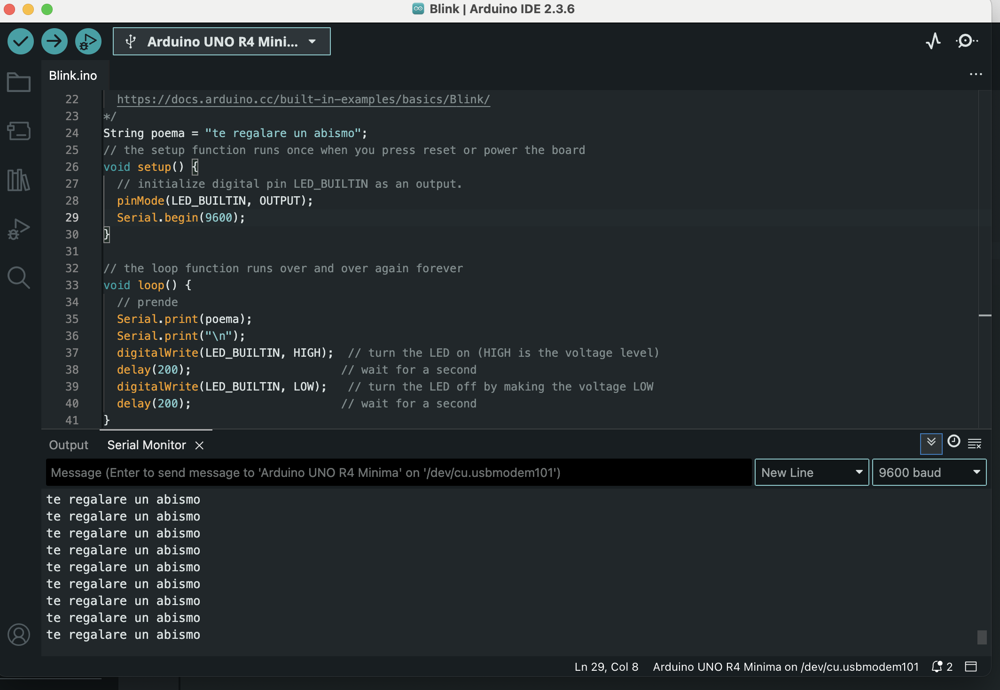
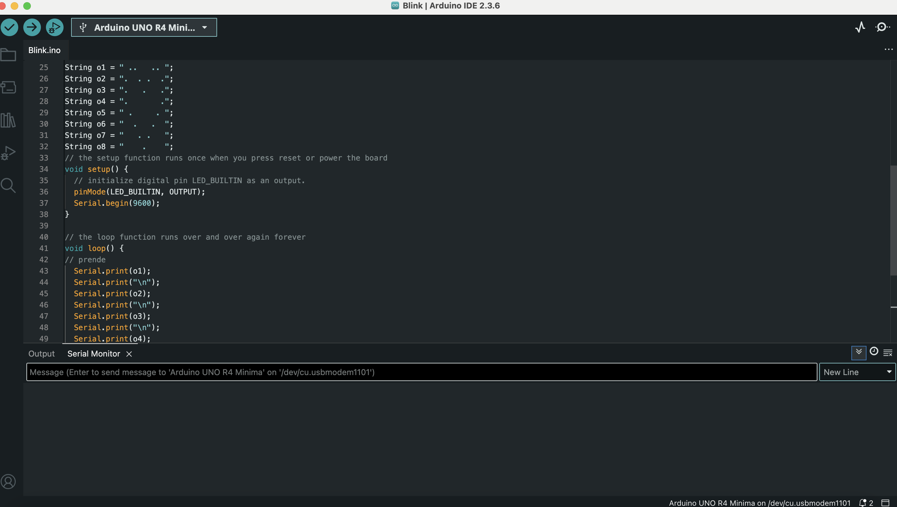
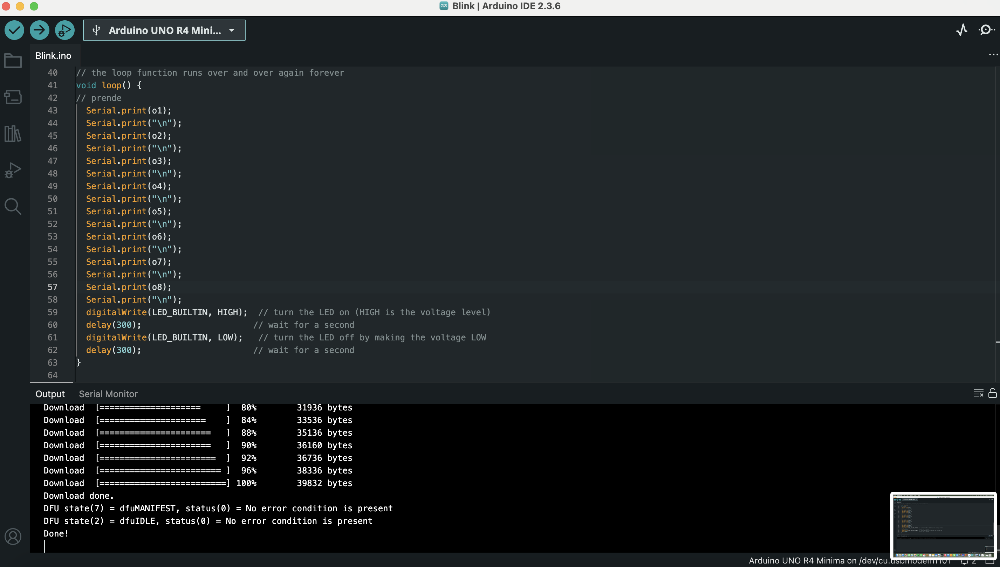
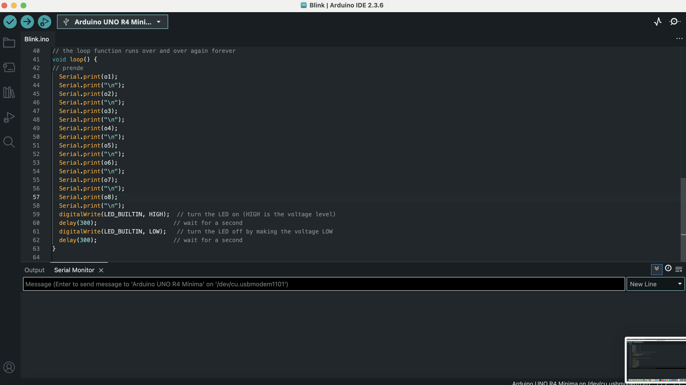
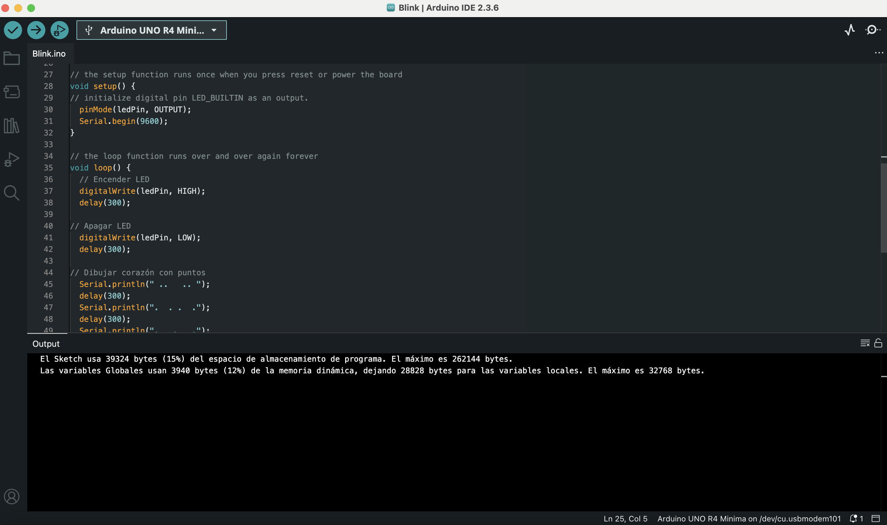

# sesion-01b

08-08-2025

## Apuntes

- Funciones Gmail
  - BCC: Es para que a todos los llegue el correo pero la respuesta no interviene con otros.
  - CC: Es para hacer la copia del correo enviado, a alguien más
  - Replyall: Responder a todos
- Cada vez que se aprieta el botón reset en el arduino, se resetea, se apaga y vuelve a prender.
- Si se aprieta 2 veces el botón reset, el arduino se olvida de todo lo anterior.
- Lo que está dentro de los paréntesis son "Parámetros"
- El orden las declaraciones no importa cuando se hace el check.
- Trabajamos con datos que viven en la memoria
- En las funciones, al terminar, va un paréntesis


Para que no se me olvide enlazar imagen...

```cpp

```

### Arduino

¿Qué es un Arduino? 

Es una plataforma de hardware y software de código abierto que facilita la creación de proyectos electrónicos interactivos. Consiste en una placa programable (microcontrolador) y un entorno de desarrollo integrado IDE que se usa para escribir y cargar el código.

- **Arduino IDE** --> Integrated Development Environment, entorno de desarrollo integrado, es una interfaz gráfica donde tiene varios software que conviven entre sí.  Se conecta a las placas Arduino para cargar los códigos. Se utiliza el lenguaje *C++* que es una extensión del lenguaje C que incorpora la programación orientada a objetos (OOP), permitiendo el desarrollo de software de alto rendimiento para aplicaciones como sistemas operativos, videojuegos, navegadores web, etcétera.

### Lenguaje de Arduino

- **Serial monitor**: Todo lo que tenga serial pasa por aquí. 
- **( )** : Parentesis.
- **[  ]** : Corchete.
- **{ }** : Murciélago.
- **!** :
- **//** :Viene un comentario.
- **||** :
- **✔️** : Para enviar código.
- **->** :Para verificar código.
- ***/** :Abrir comentario.
- ***/** : Cerrar un comentario.
- **;** : La línea terminó.
- **=** : Dentro de la izquierda vive el valor de la derecha. Asignar valor.
- **==** : Se compara. Condición.   
- **HIGH**: Lo que está en 1
- **LOW**: Lo que está en 0
- **delay**: Significa que el arduino manda la señal y se queda ahí por un segunso, se vita que se queme. *Le dice al arduino congelado.*
- **Void**:
- **int**: Son variables.
- **foat**:Para decimales.
- **Char** Sólo una letra o un caracter.
- **String**: Colección de carácteres.
- **bool**: si//no
- **AND**: Debe cumplir todas.
- **OR**: Debe cumplir alguna.
- **command t**: Se ordena en el arduino.
- **Serial.println**: Imprime en otra línea.
- **Serial.print**: Imprime en la misma línea.
- **for**: Iteración.
- **if:** Si pasa algo funciona. Es como si tuviera mas opciones. Para hacer o no hacer cualquier código.
- **else**:
- **Serial.being()**: Es una función y lo que esta en el paréntesis es el valos que se le asigna.

### Elementos y comandos del código en arduino

${\color{greenyellow}Comentarios}$: </br>
Son líneas de texto que sirven para añadir notas, textos explicativos y documentar el código fuente, facilitando su compresión para el programador.

```cpp
pinMode( text, example); // comentario arduino
```

${\color{greenyellow}voidSetup}$(): </br>
Se utiliza para toda aquella acción que necesita ser realizada una única vez, justo después de encender o reiniciar la placa Arduino. 

```cpp
void setup() {
  // El pin 4 funcionará como una salida
  pinMode(4, OUTPUT);
}
```

${\color{greenyellow}voidLoop}$(): </br>
Bucle principal del programa, donde se escribe el código que se ejecutará de forma continua e indefinida, este se utiliza después del setup. Ej: Si colocas una secuencia de números en void loop(), el Arduino los "imprimirá" repetidamente, mostrando 1, 2, 3... una y otra vez, sin parar. (c++ sacado de FranUdp)

```cpp
void loop () {
    linea 1; // Comienza ejecutando el código desde aquí
    linea 2;
    linea 3; // Cuando termine de correr esta línea, el código vuelva a correr desde la línea 1
```

${\color{greenyellow}pinMode}$(): </br>
Se utiliza para configurar cada pin digital, si queremos que sea un input o un output. 
- Pin: el número del pin que deseas configurar.
- Mode: el modo de operación, puede ser:
  - Input: configura el pin como entrada.
  - Output: configura el pin como salida, para que el pin pueda enviar señales, como por ejemplo que encienda un led.

Ejemplo de google

```cpp
void setup() {
  pinMode(13, OUTPUT); // Configura el pin 13 como una salida para encender un LED
  pinMode(4, INPUT_PULLUP); // Configura el pin 4 como entrada con pull-up para un botón
}

void loop() {
  // En el loop() se podrían leer el estado del botón y controlar el LED
}
```

${\color{greenyellow}digitalWrite}$(): </br>
Hace que un pin definido como OUTPUT emita o no una señal (voltaje) cuando le indiquemos. La señal puede ser HIGH o LOW, lo que te permite activar o desactivar componentes conectados a ese pin.

```cpp
digitalWrite(13, HIGH); // Enciende el LED
  delay(1000);            // Espera 1 segundo
  digitalWrite(13, LOW);  // Apaga el LED
  delay(1000);            // Espera 1 segundo
```

${\color{greenyellow}delay}$(): </br>
Sirve para pausar la ejecución durante un tiempo específico, que se indica en milisegundos, antes de continuar con la siguiente línea de código.

```cpp
digitalWrite(LED_BUILTIN, HIGH); // Enciende el LED
      delay(3000);                     // Espera 3 segundo (3000 milisegundos)
      digitalWrite(LED_BUILTIN, LOW);  // Apaga el LED
      delay(3000);                     // Espera 3 segundo
```

${\color{greenyellow}int}$(): </br>
Se usa para declarar una variable, la variable puede guardar números enteros (10,50,100,etc).

Ejemplo de google

Donde:
 - int: es el tipo de dato (entero).
 - contador: es el nombre de la variable.
 - 0 es el valor inicial.

```cpp
void setup() {
  // Declarar una variable entera llamada 'contador' e inicializarla con 0
  int contador = 0;

  // Usar la variable en el bucle
  contador = contador + 1;
}

void loop() {
  // El código aquí se ejecuta repetidamente
}
```

${\color{greenyellow}float}$(): </br>
Se usa para declarar variables que almacenarán números decimales.

Ejemplo de google

```cpp
float miTemperatura = 25.5;
float miVoltaje = 3.14159;
```

${\color{greenyellow}bool}$(): </br>
Representa un valor booleano que puede ser verdad (TRUE) o falso (FALSE). Sirve para controlar el flujo del programa, usándose en sentencias condicionales como if y bucles como while para tomar decisiones basadas en la condición.

- Valores: variable bool solo almacena dos opciones, true or false
- Condiciones: se utiliza para evaluar condiciones, que se traducen a un resultado de true o false, lo que determina si el código se ejecuta o no.

Ejemplo de google

```cpp
bool ledEncendido = true; // Variable booleana para controlar el estado del LED

void setup() {
  pinMode(13, OUTPUT); // Configura el pin 13 como salida
}

void loop() {
  if (ledEncendido) {
    digitalWrite(13, HIGH); // Enciende el LED si ledEncendido es true
  } else {
    digitalWrite(13, LOW);  // Apaga el LED si ledEncendido es false
  }
}
```

${\color{greenyellow}char}$(): </br>
Se utiliza para almacenar solo 1 carácter, como una letra, número o símbolo. Se escribe con comillas simples

```cpp
char letra = 'V';
```

${\color{greenyellow}string}$(): </br>
Se utiliza para almacenar una secuencia de caracteres o texto. Se escribe con comillas dobles

Ejemplo de google 

```cpp
String mensaje = "¡Hola, Mundo!";
Serial.println(mensaje);
```

## Códigos vistos en clases 

```cpp
String poema = "te regalare un abismo";
// the setup function runs once when you press reset or power the board
void setup() {
  // initialize digital pin LED_BUILTIN as an output.
  pinMode(LED_BUILTIN, OUTPUT);
  Serial.begin(9600);
}
```

```cpp
// the loop function runs over and over again forever
void loop() {
  // prende
  Serial.print(poema);
  Serial.print("\n");
  digitalWrite(LED_BUILTIN, HIGH);  // turn the LED on (HIGH is the voltage level)
  delay(200);                      // wait for a second
  digitalWrite(LED_BUILTIN, LOW);   // turn the LED off by making the voltage LOW
  delay(200);                      // wait for a second
}
```


### Encargo 02

Hacer variables que no funcionen, mínimo 3. Ejemplo: código morse, números aleatorios, calculadora, dado, etc.

- Traté de realizar un corazón mediante puntos, primero no me funcionó, la verdad no sabría explicar porqué










