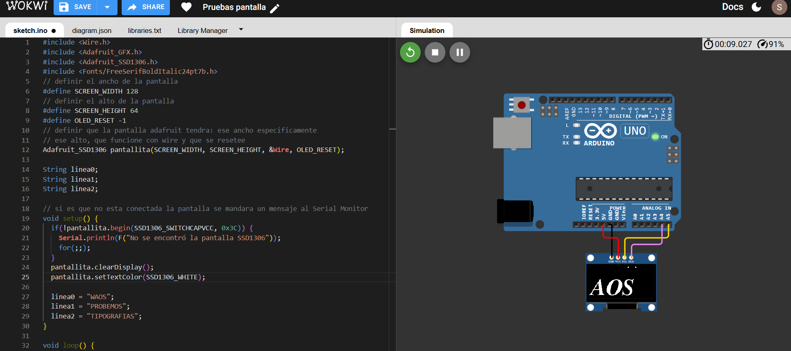
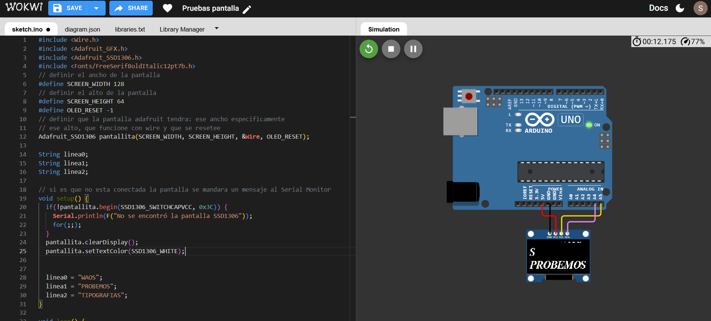

# sesion-03b

Hablamos de distintos componentes y de la manera que acabaríamos usandolos eventualmente

Nos mencionaron tinkercad, wokwi, simuladores para distintos circuitos y componentes que tal vez no tuviéramos, y de esta manera podemos probar componentes sin la necesidad de comprarlos y “gastar” plata.

Para esta clase usaremos Wowki debido a que tiene un arduino y pantalla similares a las que ocuparemos en el plano físico la siguiente clase

La pantalla que ocuparemos tiene 4 conexiones:
Ground que es tierra, que deberia tener un cable de color frio
Vcc es la energía, donde los componentes están calibrados a cierto voltaje, qu ees necesario para funcionar

Vamos a subir la librería de adafruit gfx, esta librería se ocupa mucho para hacer graficas

Aprendimos a añadir librerías a nuestra app de arduino

## módulo después del break

A la vuelta del break, Aarón Montoya nos explico la razón del porqué es importante el revisar que tengamos de manera organizada nuestras carpetas, para el funcionamiento correcto de nuestro código

Now demostraron las maneras que se podían ocupar estas librerías, para hacer dibujos, animaciones, cargar imágenes, texto, etc, de una manera tan brutal que personalmente no alcance a escribir debido a la gran cantidad de informacion, pero si logre comprender, donde se deberian usar las distintas funciones asignadas por la misma librería para poder hacer cada acción designada.

Tenemos que explorar y dar atribuciones de donde saquemos todo el codigo del cual nos hemos basado para nuestra evaluacion del viernes 29 de agosto

## encargo 7 "documentar aprendizajes y dificultades del trabajo con pantallas y displays SSD1306 con simulador Wokwi"

Para trabajar con la pantalla SSD1306 en wowki, como se explico en clase tendré que cargar las librerías de adafruit

Para no partir de 0 ocupare uno de los ejemplos los cuales se entregan al tener la librería de adafruit en mi dispositivo

Cargando el ejemplo de 128x64, con el protocolo de comunicación que vamos a usar el i2c

Uno de los elementos que podemos usar para hacer más interesante nuestro poema son las tipografías que están incluidas, con la ayuda de la pagina learn adafruit, empecé a leer para conocer cómo era posible que cargara estas tipografías:

<https://learn.adafruit.com/adafruit-gfx-graphics-library/using-fonts>

Tomando un ejemplo que Aarón había dejado en la clase donde el texto hacia scroll por si mismo, que sería el siguiente:

``` c++
#include <Wire.h>
#include <Adafruit_GFX.h>
#include <Adafruit_SSD1306.h>

#define SCREEN_WIDTH 128
#define SCREEN_HEIGHT 64
#define OLED_RESET -1
Adafruit_SSD1306 pantallita(SCREEN_WIDTH, SCREEN_HEIGHT, &Wire, OLED_RESET);

int contador = 0;

String linea0;
String linea1;
String linea2;

void setup() {
  if(!pantallita.begin(SSD1306_SWITCHCAPVCC, 0x3C)) {
    Serial.println(F("No se encontró la pantalla SSD1306"));
    for(;;);
  }
  pantallita.clearDisplay();
  pantallita.setTextColor(SSD1306_WHITE);

  linea0 = "respuesta del oraculo";
  linea1 = "hagas lo que hagas";
  linea2 = "te arrepentiras";
}

void loop() {
  pantallita.clearDisplay(); // Limpiamos toda la pantalla
  
  testscrolltext(linea0);
  testscrolltext(linea1);
  testscrolltext(linea2);
  
  pantallita.display(); // Actualiza la pantalla
}

// void testscrolltext(void) {
  // cambiar la linea anterior
  // para agregar parametro String
  // de input
  void testscrolltext(String texto) {
  pantallita.clearDisplay();

  pantallita.setTextSize(2); // Draw 2X-scale text
  pantallita.setTextColor(SSD1306_WHITE);
  pantallita.setCursor(10, 0);
  // pantallita.println(F("scroll"));
  // mod que le hice yo
  pantallita.println(texto);

  pantallita.display();      // Show initial text
  delay(100);

  // Scroll in various directions, pausing in-between:
  pantallita.startscrollright(0x00, 0x0F);
  delay(2000);
  pantallita.stopscroll();
  delay(1000);
  pantallita.startscrollleft(0x00, 0x0F);
  delay(2000);
  pantallita.stopscroll();
  delay(1000);
  pantallita.startscrolldiagright(0x00, 0x07);
  delay(2000);
  pantallita.startscrolldiagleft(0x00, 0x07);
  delay(2000);
  pantallita.stopscroll();
  delay(1000);
}
```

donde había una cantidad de texto menor a las 400 que tenía el ejemplo de Adafruit, donde elimine las líneas del código en las que se aplicaba el scroll, solo dejándome con display del texto si, para poder probar el cargar la tipografía que yo quería a parte de comentar la mayoria de cosas que si entendía



``` c++
#include <Wire.h>
#include <Adafruit_GFX.h>
#include <Adafruit_SSD1306.h>
// dentro de la libreria, especificamente incluir esta tipografia y sus parametros
#include <Fonts/FreeSerifBoldItalic24pt7b.h>
// definir el ancho de la pantalla
#define SCREEN_WIDTH 128
// definir el alto de la pantalla
#define SCREEN_HEIGHT 64
#define OLED_RESET -1
// definir que la pantalla adafruit tendra: ese ancho especificamente
// ese alto, que funcione con wire y que se resetee
Adafruit_SSD1306 pantallita(SCREEN_WIDTH, SCREEN_HEIGHT, &Wire, OLED_RESET);

String linea0;
String linea1;
String linea2;

// si es que no esta conectada la pantalla se mandara un mensaje al Serial Monitor
void setup() {
  if(!pantallita.begin(SSD1306_SWITCHCAPVCC, 0x3C)) {
    Serial.println(F("No se encontró la pantalla SSD1306"));
    for(;;);
  }
  pantallita.clearDisplay();
  pantallita.setTextColor(SSD1306_WHITE);
  

  linea0 = "WAOS";
  linea1 = "PROBEMOS";
  linea2 = "TIPOGRAFIAS";
}

void loop() {
  pantallita.clearDisplay(); // Limpiamos toda la pantalla
  //seteo el tamano de la tipografia
  pantallita.setTextSize(1);
  // dejo el color que quiero que sea mi texto
  pantallita.setTextColor(SSD1306_WHITE);
  // donde empezaria el texto, para probar lo pondre al medio de la pantalla
  pantallita.setCursor(SCREEN_WIDTH/2, 0);
  // la tipografia la cual previamente carge, sera llamada a 
  // funcionar dentro del display del arduino
  pantallita.setFont(&FreeSerifBoldItalic24pt7b);

  // hacer que cada linea de texto empiece en una linea distinta
  pantallita.println(linea0);
  pantallita.println(linea1);
  pantallita.println(linea2);
 
  pantallita.display(); // Actualiza la pantalla
}


```

Donde funcionó, la carga de la tipografía, pero quedaba de un tamaño muy grande, lo cual en un principio no entendí, ya que había seteado que el tamaño del texto fuese 1, pero al leer el nombre del archivo, me di cuenta del hecho de que contenía esto “24pt” que al menos a mi me sonaba a puntos, la medida que se ocupa para la tipografía, puede ser posible que esta tipografía que intente cargar estuviese solo disponible en este tamaño

probe cambiarlo a un archivo de tipografía que tuviese un número menor antes del pt y efectivamente, era ese el problema donde me quedo de esta manera:



``` c++
#include <Wire.h>
#include <Adafruit_GFX.h>
#include <Adafruit_SSD1306.h>
#include <Fonts/FreeSerifBoldItalic12pt7b.h>
// definir el ancho de la pantalla
#define SCREEN_WIDTH 128
// definir el alto de la pantalla
#define SCREEN_HEIGHT 64
#define OLED_RESET -1
// definir que la pantalla adafruit tendra: ese ancho especificamente
// ese alto, que funcione con wire y que se resetee
Adafruit_SSD1306 pantallita(SCREEN_WIDTH, SCREEN_HEIGHT, &Wire, OLED_RESET);

String linea0;
String linea1;
String linea2;

// si es que no esta conectada la pantalla se mandara un mensaje al Serial Monitor
void setup() {
  if(!pantallita.begin(SSD1306_SWITCHCAPVCC, 0x3C)) {
    Serial.println(F("No se encontró la pantalla SSD1306"));
    for(;;);
  }
  pantallita.clearDisplay();
  pantallita.setTextColor(SSD1306_WHITE);
  

  linea0 = "WAOS";
  linea1 = "PROBEMOS";
  linea2 = "TIPOGRAFIAS";
}

void loop() {
  pantallita.clearDisplay(); // Limpiamos toda la pantalla
  //seteo el tamano de la tipografia
  pantallita.setTextSize(1);
  // dejo el color que quiero que sea mi texto
  pantallita.setTextColor(SSD1306_WHITE);
  // donde empezaria el texto, para probar lo pondre al medio de la pantalla
  pantallita.setCursor(SCREEN_WIDTH/2, 0);
  // la tipografia la cual previamente carge, sera llamada a 
  // funcionar dentro del display del arduino
  pantallita.setFont(&FreeSerifBoldItalic12pt7b);

  // hacer que cada linea de texto empiece en una linea distinta
  pantallita.println(linea0);
  pantallita.println(linea1);
  pantallita.println(linea2);
 
  pantallita.display(); // Actualiza la pantalla

}

```

Ahora iba mejor el camino, pero me surgio otra duda, porque no estoy seguro de porqué el “waos” que tenía escrito como mi primera línea de texto era la que salía cortada esta vez

///////////////////////////////////////

Como herramienta de interacción desde mi código hacia el Arduino, lo que más me llamaba la atención era el uso de un potenciómetro, ya que no tenía idea cómo el cambio de la cantidad de resistencia interna del potenciómetro podía ser leído como datos para el arduino

Buscando en la página de documentación de arduino encontré la siguiente página, donde explican de una manera excelente que era un potenciómetro, con ejemplos de cómo poder usarlo:

<https://docs.arduino.cc/learn/electronics/potentiometer-basics/>

He de dejar claro el hecho de que los ejemplos que proveía la página de las básicas del potenciómetro contenían ejemplos, que almenos yo consideraba más haya de la evaluación, donde se ocupaba con múltiples otros componentes, y que al menos yo consideraba como el uso tradicional del potenciómetro dentro de un circuito, pero en esa misma página había una redirección a una página donde se usa el potenciómetro de una manera en la que se pudiesen leer datos, justo lo que quería aprender a usar:

<https://docs.arduino.cc/built-in-examples/basics/AnalogReadSerial/>

En esta página se presenta el cómo pasar un input del mundo físico y táctil hacia el mundo de los datos dentro del arduino a partir de la lectura de el input análogo

También explica que el arduino nativamente tiene un convertidor de  análogo-a-digital de 10 bits, osea 2^(10) que equivale a 1024, donde existen 1024 parámetros que si es que lo necesitara, podría ocupar todo este rango, o dividirlo en la cantidad que deseara
